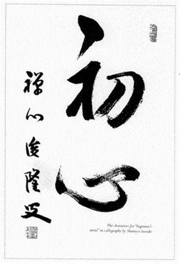
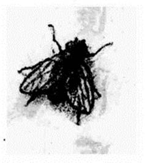
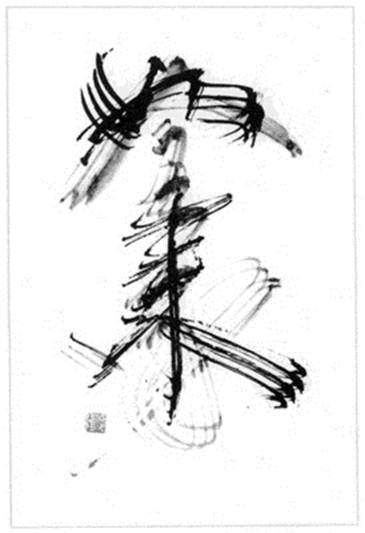

title: 禅者的初心

author: 铃木俊隆

tags: [reading, raw]

source: epub

[]

[[铃木书法的禅道]]

[["初心"两个毛笔字，出自铃木禅师的手笔。书法的禅道注重坦率简朴，较不在意技巧或美观，写书法时应该像个初学者那样，全神贯注去写，俨如是第一次发现你所要写的东西那般。]]

[]

[[迈克的"苍蝇"]]

[[迈克是位画家，学禅多年，当他应邀为本书画些什么时，他说："我画不出一幅禅画，但我却想到'苍蝇'这个点子。"]]

[]

[[真如就是禅心]]

[["如来"二字为铃木禅师亲笔书写。当铃木禅师用笔尖已磨损、分叉的毛笔写下这两个字时，他说："我要用它来表现'如来'是整个世界的身体。"]]

[[日本有两位对西方最有影响的铃木禅师。半世纪以前，铃木大拙只手将禅带到了西方，这个移植的历史重要性，被认为可媲美亚里士多德和柏拉图，他们两人的作品分别在13和15世纪被翻译成拉丁文。50年后，铃木俊隆做出了几乎不遑多让的贡献。在他唯一留下的这本书中，那些对"禅"感兴趣的美国人所找到的，正好是他们所需要的最佳补充。]]

[[铃木大拙的禅是风风火火的，反观铃木俊隆的禅则显得平实无奇。"开悟"是铃木大拙禅道的核心，而他的作品之所以引人入胜，这个眩目的观念居功不少。但在铃木俊隆的这本书里，"开悟"或是其近义词"见性"却从没出现过。]]

[[铃木俊隆禅师入寂前四个月，我找到个机会问他："这本书为什么没有谈到开悟]?["禅师还未开口，他太太就凑过来，调皮地轻声说："因为他还没开悟嘛]!["禅师装出一脸惊恐的样子，用扇子拍拍太太，竖起一根手指在嘴边说："嘘，千万别说出去]!\"[大家都笑翻了。等到笑声沉寂下来，禅师说出了真正的原因："开悟不是不重要，只是它并非禅需要强调的部分。"]]

Farlas[）所说：]]

> [[他的无我态度极为彻底，不留下任何我们可以渲染的奇言怪行。而尽管他没有留下任何世俗意义上的丰功伟绩，但他的脚印却带领着看不见的世界历史向前迈进。]]

[[禅师遗下的功绩包括了美国塔撒加拉山的禅山禅修中（]Zen

Mountain

Center,[西方第一家曹洞宗禅寺）以及旧金山的禅修中心；而对一般大众而言，他留下的，则是这本书。]]

[[不抱任何饶幸心理，他早就为弟子们做好心理建设，让他们可以面对最艰难的时刻，也就是目睹他的形体从这世界消失、归于虚空的那个时刻：]]

> [[我临终时若受着痛苦，那不打紧，不要在意；那就是受苦的佛陀。你们可别因此产生混淆。或许每个人都要为肉体的痛苦与精神的痛苦而努力挣扎，但那并不打紧，那不是什么问题。我们应该深深感激自己拥有的是一个有限的身体......像是我的身体、你的身体。要是我们拥有无限的生命，那才是真正的大问题。]]

[[他也事先安排好传法事宜。在1971年11月21日举行的"山座仪式"上，他立理查德·贝克（]Richard

Baker)[为其法嗣。当时，他的癌症已恶化到必须由儿子搀扶才能行走的地步。然而，每走一步，他的禅杖都叩地有声，透露出这个人虽然外表温文，内心却有着钢铁般的禅意志。理查德接过袈裟时，以一首诗作为答礼：]]

> [ ]

> [[这炷香]]

> [[我执持良久]]

> [[现在要以"无手"]]

> [[奉给我的师父、我的朋友]]

> [[也是这座寺院的创立者]]

> [[铃木俊隆大师]]

> [[你有过的贡献，无可衡量]]

> [ ]

> [[与你走在佛陀的微雨中]]

> [[我们衣袍湿透]]

> [[但莲花瓣上]]

> [[却无滴雨停驻]]

> [ ]

[[两星期后，禅师入寂了。在12月4日举行的丧礼上，贝克禅师向出席者朗诵了以下的赞辞：]]

> [[当师父或弟子都是不容易的亊，尽管那必然是此生中的至乐。在一片没有佛教的土地弘法也不容易，但他却度化了许多弟子、僧众、俗众，让他们走在佛道上，为全国数以千计的人带来了生命的改变。要开创和维持一座禅寺很不容易，何况还加上一个市区的禅修团体、加州以及美国其他地区的许多禅修中心。]]

> [[但这些"不容易"的事、这些非凡的成就在他手里却是举重若轻，因为他倚仗的是自己的真实本性，也就是我们的真实本性。他留下的遗泽不亚于任何人，而且无一不是要紧的：佛的心、佛的修行、佛的教诲与人生。他就在这里，就在我们每一个人之中，只要我们想他。]]

[[休斯顿·史密斯（]Huston Smith)]

[[麻省理工学院哲学系教授、]]

[[《人的宗教》作者]]

[[但是，对大部分读者而言，这本书则是一位禅师如何讲禅和教禅的榜样。这是一部指导人们如何修行的书，其中也说明了何谓禅生活，以及禅修是以何种态度和了解为前提的。它鼓励读者去实现自己的真实本性、自己的禅心。]]

[[何谓"禅心"？]]

[[禅心是禅门老师常用的谜样字眼之一，他们用这字眼来提醒弟子们跳出文字障碍，刺激弟子对自己的心和自身的存在产生惊奇。这也是所有禅训练的目的------让你产生惊奇，迫使你用你本性最深邃的表现来回应此惊奇。]]

[[何谓"初心"？]]

[[禅修的心应该始终是一颗初心（初学者的心）。那个质朴无知的第一探问（"我是谁]?["）有必要贯彻整个禅修的历程。初学者的心是空空如也的，不像老手的心那样饱受各种习性的羁绊。他们随时准备好去接受、去怀疑，并对所有的可能性敞开。只有这样的心才能如实看待万物的本然面貌，一步接着一步前进，然后在一闪念中证悟到万物的原初本性。]]

[[这种禅心的修行全书遍处可见。这本书的每一章节都直接或间接地碰触到这个问题------如何才能在修行生活和日常生活中保持初心。这是一种古老的教学法，利用的中介是最简单的语言和日常生活的情境。它的精神是，学禅的人应该自己教育自己。]]

[[初心是道元禅师爱用的词语。本书扉页及书眉上随处可见的两个毛笔字------"初心"，也是出自铃木禅师的手笔。书法的禅道注重坦率简朴，较不在意技巧或美观。写书法时应该像个初学者那样，全神贯注去写，俨如是第一次发现你所要写的东西那般。如此一来，你的全部性情就会表现在书法里。禅修之道也是如此。]]

[[将声音变成文字]]

[[出版这本书的构想源自铃木禅师的人室弟子------玛丽安•德比（]Marian

Derby)[，她是洛斯拉图斯（]Los

Altos)[禅修团的负责人。铃木禅师固定一或两个星期参加该团的坐禅一次。禅师坐禅后会讲讲话，为学员们加油打气，帮助他们解决各种疑难杂症，玛丽安就把这些对话录了下来。]]

[[不久之后，她就意识到这些对话具有连贯性和系统性，值得整理成书，也可借此为禅师非凡的精神和教诲留下一个弥足珍贵的记录。于是，玛丽安花了几年时间，把录音带的内容整理出来，也就成为本书的第一份初稿。]]

[[接着，负责加工这份初稿的人是铃木禅师另一位入室弟子------楚蒂•狄克逊（]Trudy

Dixon)[。她的编辑经验很丰富，一直以来都负责禅修中心刊物《风铃》（]Wind

Bell)[的编辑。她要把初稿整理和组织成为可以出版的形式。但要编这样的一本书并不容易，我们在这里把这些"不容易"的理由一一说明，有助于读者对这本书能有更好的理解。]]

[[铃木禅师谈佛法时，采取的是最困难但也最有说服力的方式------从人们的日常生活情境切入。他还试图以一些极简单的语句（例如"喝茶去吧！"）来传达佛教的整个精神。因此，编辑必须十分警觉，才不会为求文字的清晰或文法的通顺而删掉这些别具深意的语句。]]

[[另外，如果不是对禅师很熟悉或是曾与他共事过的人，也很容易误删掉一些可以表现禅师人格、精力或意志的背景性说明。再来还有重复的部分、一些看似晦涩的语句以及所引用的诗句，编辑一不小心，就会把这些能加深读者印象的成分给删掉。事实上，读者若能仔细阅读那些看似晦涩或多余的语句，反而会发现它们其实充满了启发性。]]

[[语言的转换充满挑战]]

[[让编辑在整理稿件的工作上更为困难的是，英语的基本假设完全是二元性的，不像日语历经了几百年，而发展出一套可以表现佛教非二元性观念的语汇。铃木禅师讲话的时候，时而使用日文的思考方式，时而使用英文的思考方式，两种文化的语汇交替运用，随心所欲。在他的禅语之中，这两种语言带着诗意和哲学气息而融合在一起了。然而在转写的过程中，停顿、节奏和语气的强调，这种种可带给他的话语更深意涵和整合性的语言手段，却都很容易流失。为此，楚蒂花了好几个月的时间去跟禅师讨论，以求尽可能保留一些原来的用字和味道，与此同时又兼顾到英文书稿的可读性。]]

[[楚蒂依重点的不同而把本书划分为三部分："身与心的修行"、"在修行的道路上"，以及"用心理解"。这样的区分，分别大致对应于身体、感觉与心灵的部分。她还为每一章节的谈话选择一个标题，并附以一两句引言]([通常都是引自该节的讲话内容）。楚蒂的选择多少有点武断，但她这样做，却可以在标题、引言和谈话内容间制造出一种张力，鞭策读者更深入地思索话语的内容。]]

[[书中的谈话唯一不是在洛斯拉图斯禅修团发表的，是"后记"部分，这部分是禅修中心搬入旧金山现址时，禅师两次讲话内容的浓缩版。]]

[[用生命编辑此书]]

[[结束这本书的编辑工作没多久，楚蒂就死于癌症，当时她年仅30，留下了丈夫迈克和两个小孩（安妮和威尔）。迈克是位画家，本书扉页上的苍蝇就是他画的。迈克学禅多年，当他应邀为本书画些什么时，他说：]\"[我画不出一幅禅画。除了这幅画以外，我想不出能画点什么。我更绝对画不出蒲团或莲花或诸如此类的图画，但我却想到'苍蝇'这个点子。"]]

[[在迈克的画作上，常可见到一只现实主义笔触的苍蝇。铃木禅师对青蛙一向赞誉有加，因为青蛙坐着的时候，安静得好像睡着了一样，但它实际上充满了警觉性，不让任何一只从它面前飞过的昆虫跑掉。说不定迈克的"苍蝇"就是在等待这只"青蛙"。]]

[[在编排《禅者的初心》这本书的整个过程，楚蒂全程与我共事，她要求我把最后的整理工作完成，并负责安排及监督印刷和出版事宜。我考虑过几家出版商，最后选定]Weather

hill[出版公司，它的设计、排版完全符合这本书应有的样子。稿子付梓前曾经过水野弘元教授过目，他是驹泽大学佛教学部部长，同时也是印度佛教的知名学者。他慨然帮助我们把一些梵文和日文的佛教术语给翻译出来。]]

[[禅师的弘法人生]]

[[玉润禅师在铃木禅师30岁那年入寂。因此，铃木禅师尽管年轻，仍必须同时照管两座寺院，一座是师父的林宗院，另一座是父亲的禅寺（他的父亲在玉润禅师人寂后不久也去世了）。林宗院是一座小禅寺，也是为数约两百座小寺的总寺。铃木禅师担任林宗院住持任内，其中一个主要任务就是要遵照师父遗愿，依传统方式将林宗院加以改建。]]

[[在20世纪30和40年代，禅师在林宗院带领一些讨论小组，对日本政府的军国主义作风和行动提出质疑，这在当时相当罕见。大战前夕，禅师就有去美国弘法的念头，当时因为师父坚不应允，他就只好放弃。但在1956年和1958年，一位朋友（日本曹洞宗的领导人）两次力邀他到旧金山，带领一个当地的日本曹洞宗团体。力邀第三次时，铃木禅师终于答应前往。]]

[[将禅带到西方世界]]

[1959[年时，55岁的铃木禅师来到了美国。经过好几次的延后归程，最后，他决定留在美国弘法。禅师会留下来是因为他发现，美国人都怀有一颗"初心"，对禅很少有既定的成见，相当愿意对禅敞开，相信禅能为他们的人生带来帮助。此外，禅师也发现，美国人问问题的方式可以为禅注入新的生命。]]

[[在禅师抵达美国不久，就有好些人围聚在他身边，请求跟从他学禅。禅师的回答是：]\"[我每天大清早都会坐禅，如果你们有兴趣，不妨来与我同坐。"自此，追随铃木禅师的人与日俱增，至今在加州已有六个据点。]]

[[当时他最常待的地方是旧金山市佩奇街（]Page

Street)300[号的禅修中心（共有60名弟子住在那里，固定来坐禅的人数就更多了），以及位于卡梅尔谷（]Carmel

Valley)[上方的塔撒加拉泉（]Tassajara

Springs)[的禅山禅修中心。后者是美国的第一座禅寺，固定会有为数大约60名的学员，从事为期三个月或更长时间的修行。]]

[[师徒之间]]

[[楚蒂认为，如果能让读者明白弟子们对铃木禅师有何感受，将比任何事情都更能帮助读者理解禅师在这本书里的谈话。这位师父所给予弟子们的，其实就是这些谈话内容的一个活生生的例证------证明他所倡导的那些看似不可能实现的目标，真的可以在这一生中体现。]]

[[各位若修行得愈深，就愈能明了师父的心，并且终究会明白，自己的心和师父的心都是佛心。各位还将会明白，坐禅乃是各位真实本性最完美的表现。以下是楚蒂对禅师的两段赞辞，很能说明禅师与徒弟之间的关系：]]

> [[一位禅师就是实现了完全自由的人，而这种完全自由是所有人类的潜能。他无拘无束地生活在他整个存在的丰盈里。他的意识之流不是我们一般自我中心意识那种固定的重复模式，而是会依实际的当下环境自然地生发出来。结果就是，他的人格表现出各种不凡的素质：轻快、活力充沛、坦率、简朴、谦卑、真诚、喜气洋洋、无比善悟与深不可测的慈悲。他的整个人见证了何谓"活在当下"的真实之中。]]

> [[但到头来，让众弟子感到困惑、入迷和被深化的，并不是老师的不平凡，而是他的无比平凡。因为他只是他自己，所以得以成为众弟子的一面镜子。与他在一起时，我们意识到了自己的优点和缺点，但与此同时又不会感受到他有一丝赞美或责难。在他面前，我们看到了自己的本来面目，也看到了他的各种不平凡只是我们自己的真实本性。当我们学会把本性释放出来，师徒之间的界线就会消失，消失在佛心展开而成的一道存在与欢愉的深流里。]]

[[理查德·贝克]]

[[京都，1970年]]

[[（编按：本文中所提的内容编排构想与呈现方式，与中译本略有出入。）]]

> [ ]

> [[对于禅，我们用不着有深入的了解。哪怕你读过很多禅方面的经典，你也必须用一颗清新的心去读当中的每一句话。]]

> [ ]

[[人们都说禅修很难，但对个中原因却多有误解。禅修之所以困难，不在于要盘腿而坐，也不在于要达到开悟。它之所以困难，是因为我们难以保持心的清净，以及修行的清净。自从禅宗在中国建立之后，发展出了很多修行方式，但却愈来愈不清净。我这里不想谈中国禅或者禅宗历史，我感兴趣的只是帮助各位远离不清净的修行。]]

[[初心，即"初学者的心"]]

[一遍，可能会深受感动。但如果你读过两遍、三遍、四遍，甚至更多遍呢？说不定你会失去对它最初的感动。同样的情形也会发生在你的其他修行上。起初有一段时间，你会保持得住初心，但修行两三年或更多年之后，你在修行上也许有所精进，但本心的无限意义却相当容易会失去。]]

[[学禅者最需要谨记的就是不要坠入二元思考。我们的"本心"一切本自具足。它总是丰富而自足，你不应离失本自具足的心灵状态。自足的心不同于封闭的心，它是颗空的心，是颗准备好要去接受的心。如果你的心是空的，它就会随时准备好要去接受，对一切抱持敞开的态度。初学者的心充满各种的可能性，老手的心却没有多少可能性。]]

[[分别心会使你受到限制]]

[[如果你有太多分别心的思想，就会画地自限。如果你太苛求或贪婪，你的心就不会丰富和自足。如果你失去自足的本心，就会无戒不犯。当你的心变得苛求，当你汲汲于想要得到什么，到头来你就会违反自己誓守过的戒律，包括不妄语、不偷盗、不杀生、不邪淫等等。但要是你能保持本心，戒律就会守好它们自己。]]

[[初学者不会有"我已经达到了什么"的这种念头，所有自我中心的思想都会对我们广大的心形成限制。当我们的心很慈悲时，它就是无边无际的。我们日本曹洞宗初祖道元禅师屡屡强调，我们必须归复自己无边的本心。只有这样，我们才能忠于自己、同情众生，并且切实修行。所以，最难的事就是保持各位的初心。对于禅，我们用不着有深入的了解。哪怕你读过很多禅方面的经典，你也必须用一颗清新的心去读当中的每一句话。你不应该说"我知道禅是什么"或者"我开悟了"。这也是所有艺术真正的秘密所在------永远当个新手。这是非常要紧的一点。如果你开始禅修的话，你就会开始欣赏你的初心。这正是禅修的秘密所在。]]

[[[身与心的修行]]]

> [ ]

> [[禅修是我们真性的直接表现。严格来说，身为一个人，除这种修行外，没有别种修行；除这种生活方式外，没有别种生活方式。]]

> [ ]

> [ ]

> [[当我把左脚放到右边，同时也把右脚放到左边，我就不会知道它们哪一只是右脚，哪一只是左脚。两者同时都可以是左脚或右脚。]]

> [ ]

[[现在我想谈谈坐禅的姿势。当你采取莲华坐的坐姿时，右足是压在左大腿的下面，左足是压在右大腿的下面。当这样盘腿而坐时，尽管我们有一只左脚和一只右脚，但它们却会浑然为一。这种姿势道出了二元的同一性：非二，非一。这也是佛教最重要的教法：非二，非一。我们的身与心既非二，也非一。如果你认为身与心是二，那你就错了；但如果你认为身与心是一，你同样是错的。我们的身与心既是二，又是一。我们总以为所有事物不是一就是多于一，不是单数就是复数，但在实际经验里，我们的生命不只是复数，它也是单数。我们每一个人都既独立而又依赖。]]

[[若干年后我们都会死。如果我们认为死亡是生命的终结，那就是个误解。另一方面，如果我们认为自己不会死，那也同样是个误解。我们既会死，但我们又不会死，这才是正见。有些人认为，人死的时候只是肉体死去，而心灵或灵魂会永远长存，这也不全然是对的，因为心灵与肉体都有其尽头。但是，说心灵与肉体会永远存在却也是对的。]]

[[尽管我们有"心灵"和"肉体"这两个不同的观念，但它们实际是一体的两面，这才是正见。所以，我们坐禅时采取盘腿坐姿，为的就是要象征这个真理。当我把左脚放到右边，同时也把右脚放到左边，我就不会知道它们哪一只是右脚，哪一只是左脚。两者同时都可以是左脚或右脚。]]

[[坐正、背挺直、手放好]]

[[坐禅时最需要注意的是保持脊骨挺直。你的两耳和双肩都应该成一水平线。肩膀放松，后脑勺斜向上，正对天花板。下巴应该收拢，当你的下巴向上抬，你的姿势就不会有力量。另一个让你的姿势获得力量的方法，是把横膈膜往下压向丹田，这可以帮助你维持身体与心灵的平衡。试着保持这种坐姿，起初也许会觉得呼吸不自然，但习惯之后，呼吸就会顺畅而绵长。]]

[[你的两手应该结成"禅定印"，方法是：手掌朝上，右手手背放在左手掌中，两手中指的中间指节相触，两根拇指上举，指尖轻轻互触（就像是中间隔着一张纸）。这样一来，你的双手就会构成一个漂亮的鹅蛋形。你应该小心翼翼地保持这个手印，就像是手里抱着什么极其珍贵的物品那样。双手应该贴住身体，拇指举在肚脐的位置。两只手臂自然下垂，微微离开身体一点点，就像是它们各自夹着一颗蛋那般。]]

[[身体不要歪到一边，也不要向后仰或向前倾。应该坐得直直的，就像是天空要靠你的头才能撑起来一样。这种坐姿不只是形式，它是佛教的关键所在，是对你的佛性一个完美的表现。如果想要真正地了解佛教，就应该依照此一姿势来修行。这些形式不是获得正确心灵状态的手段，采取这些姿势本身就是正确的心灵状态。]]

[[但我们不需要获得什么特别的心灵状态。当你想要获得什么，心就会游荡到别的地方；当你没有想要获得什么，你会拥有的，就是此时此地的身体与心灵。一位禅师说过："遇佛杀佛。"如果你遇到的不是一个在当下的佛，就应把他"杀掉"，如此你才能归复自己的佛性。]]

[[做任何事都是我们本性的表现。我们不是为别的事而生存，我们生存是为了自己。这就是佛教的基本教法，由我们遵守的形式表达出来。另外，就像打坐有打坐的坐姿一样，我们站在禅堂时，也有许多规则必须遵守，但订定这些规则的目的不是要把每个人弄成一模一样，而是为了让每个人可以最自由、最自在地表现他们的自我。]]

[[例如，我们每一个人都有各自的站姿，而站姿是由身体比例来决定。当你站着的时候，两个脚跟应该相距一拳宽，两脚的大拇指应与两个乳头在同一直线上，这就跟坐禅时，应该对丹田施予若干压力一样。此外，你的双手也应该表现出你的自我。用左手抵住胸，拇指与其他手指结成圈形，右手放在上面。右手拇指向上举，两只前臂与地板平行。这样，你就会感到自己抱着根圆柱子，不会身体萎顿或歪向一边。]]

[[姿势正确才能保有自己]]

[[最重要的事情是拥有自己的身体。身体一旦萎顿，你就会失去自己，你的心也会游荡到别处去，而你也不会在自己的身体之中。这不是正道。我们必须存在于此时、此地！这是关键。你必须拥有自己的身体和心灵。万物都应该以正确的方式存在于正确的地方。这样，就什么问题都不会产生。要是我现在使用的这个麦克风是放在别的地方，它就不能发挥功能。当我们能够把身与心放在恰如其分的地方，那其他一切就会跟着恰如其分。]]

[[然而，我们通常都会不自觉地试着改变别的东西，而不是改变我们自己，我们都会试着让自己以外的东西变得恰如其分，而不是让我们自己变得恰如其分。但是如果你自己不是恰如其分的话，也就不可能让任何东西恰如其分。反过来说，要是你能在恰当的时间以恰当的方式做事情，那万事都会妥妥当当。你是"老板"耶，老板打瞌睡时，店里的每个员工都会跟着打瞌睡。但是，当老板扮演好自己，那么每一位员工也会扮演好他们自己。这就是佛教的奥秘。]]

[[随时随地保持正确姿势]]

[[所以，不只坐禅时应该努力保持正确的姿势，从事其他任何活动时莫不是如此。开车时应该保持正确姿势，看书时也应该保持正确姿势。如果你以懒洋洋的姿势看书，---定看不久。这是真正的教法，写在纸上的教法不是真正的教法。白纸黑字的教法是你脑子里的一种食物，你的脑子当然需要一些食物，但是，透过正确的修行方式让你成为你自己，那是更为重要的事。]]

[[这也是为什么佛陀无法接受他那时代的各种宗教。他研究过许多宗教，但都不满意各宗教的修行方式。他无法在苦行或哲学中找到人生的答案。他感兴趣的不是某些形而上的存在的物质，而是自己的身与心------存在于当下的身与心。当他找到自己时，他也发现一切众生皆具有佛性。这就是他的开悟。开悟不是某种舒服快乐的感觉或某种奇特的心灵状态。当你以正确的姿势打坐，你的心灵状态本身就是开悟。]]

[[如果你不能满足于坐禅时的心灵状态，心思就会左右摇摆。我们不应让自己的身心摇摆不定或四处游走。只要用我所说的方式打坐，就不必谈论怎样才是"正确的"心灵状态，因为你本然就已具有了。这就是佛教的结论。]]

> [ ]

> [[所谓的"我"，只是我们在一呼和一吸之间开阖的两片活动门而已。]]

> [ ]

[[坐禅时，我们的心总是与呼吸紧紧相随。吸气时，气会进入内在世界；呼气时，气会排向外在世界。内在世界是无限的，外在世界也同样是无限的。虽然说这话有"内在世界"和"外在世界"之分，但实际上，世界就只有一个。在这个无限的世界里，我们的喉咙就像两片活动门，气的进出就像是有人穿过这两片活动门。]]

[[我们说"我在呼吸"，但话中的"我"这个字是多余的，根本没有一个"你"可供你说这个"我"字。所谓的"我"，只是我们在一呼和一吸之间开阖的两片活动门而已。它只是开阖，如此而已。如果你的心够清净静谧，就会察觉到这个开阖里面什么都没有：没有"我"，没有世界，也没有身或心，有的只是两片活动门。]]

[[觉察呼吸就是觉察佛性]]

[[所以在坐禅时，唯一存在的只有"呼吸"。但我们应该觉察着每一个呼和每一个吸，我们不应该心不在焉。要你觉察呼吸并非意味着要你去觉察"小我"，而是意味着你应该觉察你的普遍本性，也就是你的"佛性"。这种觉察很重要，因为我们通常都会偏向一边。我们对人生的一般理解是二元性的：你和我、这跟那、好与坏......]]

[[事实上，这些分别性本身都只是对普遍存在的一种觉察。"你"意味的是以你的形相觉察这个宇宙，"我"意味的是以我的形相觉察这个宇宙。"你"和"我"不过都是两片活动门。这种了解是不可少的，甚至，那不应该被称为"了解"，而应该说，它是透过禅修所获得的真实体验。]]

[[坐禅时，没有时间与空间观念]]

[[所以在坐禅时，不应该有时间或空间的观念。你也许会说："我们从七点四十五分开始在这房间里打坐。"这就是有时间的观念（七点四十五分）和空间的观念（这房间）。但事实上你在做的，只是坐着和觉察着这个宇宙的活动，就那么多。在这一刻，活动门朝一个方向打开，下一刻，活动门朝相反方向打开。]]

[[一刻接着一刻，我们每个人都是在不停地重复这种活动。其中既没有时间的观念，也没有空间的观念。时间与空间合而为一。你也许会说："我今天下午有事情要做。"但实际上并没有"今天下午"、"一点钟"或"两点钟"这种东西的存在。你在一点钟会吃午餐，吃午餐本身就是一点钟。到时候，你会身处某个地方，但那个地方跟一点钟是分不开的。对于一个对人生能真正存有感激之心的人来说，这些都是一样的。]]

[[但是，当你厌倦了人生，或许就会说："我不应该来这地方，到别的地方吃午餐大概要好得多了，这地方的午餐不太好。"这时候，你是在脑子里创造了一个跟实际时间分离开来的空间观念。]]

[[无时空分离，无善恶对立]]

[[也或者你会说："这件事不对，我不应该做这件事情。"事实上，当你说"我不应该做这件事情"时，你已经做了某件事情，所以你别无选择。当你把时间与空间的观念分离开来，你会以为你可以有所选择，但事实上，你是非做某件事情不可的。"不做"的本身就是一种"做"。]]

[[善与恶只是存在于你心里的东西，所以我们不应该说"这是对的"、"这是错的"之类的话。与其说"这是错的"，你应该说的是："别去做]!["当你有"这是错的"的想法时，就会给自己制造出困惑。所以在清净宗教的领域中，是没有时间与空间或是对与错这样的困惑。]]

[[我们应该做的事情就是，什么事情来到，就做什么事情，好好做它！我们应该活在当下。所以坐禅时，应该专注于呼吸，让自己成为两片活动门。做我们当下应该做的事，做我们必须做的事，这就是禅修。在这种修行中，是没有困惑存在的，如果你能确立这样的生活，就不会有任何的困惑可言。]]

[[你我正如青山与白云]]

[[当我们变得真正地忠于自己，我们就会变成两片活动门，在完全独立的同时又与万物相互依赖。没有空气，我们就无法呼吸。我们每一个人都是在世界的万千事物之中，但一刹那接着一刹那，我们又都是身处于这个世界的中心。所以，我们是完全独立而又完全依赖的。]]

[[如果你有这样的体悟，有这样的存在，你就会拥有绝对的独立性，不被任何事所打扰。所以坐禅时，心念应该集中在呼吸上头。这种活动是众生的基本活动。没有这种体悟，没有这种修行，人们就不可能达到绝对的自由。]]

> [ ]

> [[有一位禅师说过："向东走一里就是向西走一里。"这是其正的自由，我们每个人都应该追寻这种完全的自由。]]

> [ ]

[[要活在佛性之中，就必须让小我一刹那又一刹那地死去。失去平衡时，我们就会死去，但与此同时我们又会茁壮成长。我们看到的一切都是变动不居的，是正在失去平衡的。任何东西之所以看起来美，就是因为它失去了平衡，但其"背景"却总呈现完全的和谐。所以，如果你只看到万物的表象，而没意识到作为它们背景的佛性，就会觉得万物都在受苦。但如果你明白了这个存在的背景，就会了解受苦本身是我们应有的生活方式，是我们可以扩大生命的方式。所以，我们的禅道有时会正面肯定生命的失衡性或失序性。]]

[[看就好了，别去掌控]]

[[现今，日本的传统绘画都变得流于形式化，而且缺乏生命力，这也正是现代艺术为何会发展起来的原因。古代画家喜欢在画面上点上一些杂乱无章却深具艺术韵味的点，这是相当困难的。因为，即便你想要把那些点安排得毫无秩序可言，但到头来你会发现，它们还是有些秩序可言。你以为你驾驭得了它，实际上却不能------要把一些点安排得毫无秩序可言，那几乎是不可能的。这个道理也适用于我们的日常生活。]]

[[尽管你想尽办法要把某些人置于你的管制之下，但那是不可能的。管理别人最好的方法是鼓励他们使坏，然后，广义地来说，他们就会受到你的管制。给你的牛或羊---片宽敞的绿草地是管好它们的方法，对人也是一样的道理。首先，让他们做他们想做的事，你从旁看守他们，这是"上策"。要是对他们置之不理，那是不对的，是"下下策"。"次下策"就是试图去驾驭他们。"上上策"是看着他们，但只是看着，不存有任何想控制他们的心。]]

[[任杂念自由来去]]

[[同样的道理也可以用在你自己身上。在坐禅时，如果你想获得完全的平静，就不应该被心中出现的各种杂念困扰，应该任它们来、任它们去，然后这些杂念反而会被你所控制。但这个方法并不容易------听起来是很容易，但事实上需要费点特别的努力。]]

[[怎么样才能达成这种努力呢？这正是禅修的秘密所在。比方说你碰到某些烦心事，要完全静下心来打坐是不可能的，如果你拼命压制心念，你的努力就是不正确的努力。唯一可帮助你的努力就是数息，或是把心念专注在一呼一吸上。我说"专注"，但把心念专注在某件事情上并不是禅的真正本意。禅的本意是如物之所如去观物的本身，让一切自来自去。这是最广义的把一切置于控制之下。]]

[[禅修的目的在于打开我们的"小心"，所以专注是为了帮助你体现"大心"，也就是包含万有的心。如果想在日常生活中发现禅的真义，你就必须要先明白，坐禅时，身体为什么要保持适当的坐姿，以及心念为什么要专注在呼吸上。你应该遵循修行的法则，这样你的修行将会愈来愈精细和谨慎。只有这个方法可以引领你，体验到禅的无上自由。]]

[[从现在走向过去]]

[[当我们体验到这种真理时，就表示我们已经悟出了时间的真义。时间都是恒常地从过去前进到现在，再从现在前进到未来。这是真的，但时间会从未来来到现在，或是从现在走向过去，这也同样是真的。有一位禅师说过："向东走一里就是向西走一里。"这是真正的自由，我们每个人都应该追寻这种完全的自由。]]

[[但没有一些规则规范，就不可能有完全的自由。很多人（尤其是年轻人）以为，所谓的"自由"就是只要我喜欢的事就可以做，禅根本无须讲什么规则。但事实上，对禅修者而言，遵行某些规则是绝对必要的。只要有规则可循，你就拥有获得自由的机会。对规则不屑一顾的人，可别想要有任何自由可言。我们之所以禅修，正是为了获得完全的自由。]]

> [ ]

> [[尽管心上会生起涟漪，但心的本性是清净的，就像是带有些许涟漪的清水。事实上，水总是带着涟漪的，涟漪就是水的修行。]]

> [ ]

[[坐禅时不要刻意压抑思考，让思考自己停止。如果有什么杂念要进入你的心，就让它进来吧，它不会待太久的。如果你刻意停止思考，那就代表你受到它的干扰了。不要被任何事物所搅扰。]]

[[杂念看似从心的外面进来的，但事实上，杂念只是你的心所产生的涟漪，只要你不为杂念所动，它们就会逐渐平伏下来。五分钟或顶多十分钟，你的心就会完全平静下来。这时候，你的呼吸会变得相当缓慢，但脉搏却会变得快一些些。]]

[[你有"大心"还是"小心"？]]

[[修行时想要让心平静下来，并不需要花太多时间。很多感觉会生起，很多杂念或思绪会涌现，但它们只是你自己的心的涟漪，没有任何东西会来自心的外部。我们一般都以为，心是一个接收自外而来的印象或经验的器物，但这不是对心的正确理解。正确的理解应该是："心包含了―切。"当你以为有什么从外头进来了，那只是意味着你的心上浮现什么。没有任何在你之外的东西可以引起困扰。你心上的涟漪是你自己制造出来的，如果你让你的心如如呈现它自身的样子，它就会变得平静。这样的心称为"大心"。]]

[[如果你的心与某种外在的事物产生连接，它就会沦为一颗"小心"，一颗有限的心。如果心不与任何其他事物有所连接，心的活动就不会有二元性，你会把为心的活动理解为只是心的涟漪罢了。大心会体验到，一切都尽在自己一心之中。]]

[[你明白以下两种心的差别吗？一种是包含一切的心，一种是与外物连接的心。两种心事实上只是同样的东西，但因为你的了解不同而有了差别，连带使你对生命的态度也因此一了解的不同而产生差异。]]

[[用大心来看待生、老、病、死]]

[[心包含了一切，这是心的本质。能体验到这点，就会让人产生宗教情感。尽管心上会生起涟漪，但心的本性是清净的，就像是带有些许涟漪的清水。事实上，水总是带着涟漪的，涟漪就是水的修行。]]

[[谈论"没有涟漪的水"或是"没有水的涟漪"，两者都是荒谬绝伦的。水与涟漪合而为一，大心与小心合而为―。当你能这样去理解你的心，你就会有安全感。你的心并不希冀任何自外而来的东西，心总是充盈的。一颗带着涟漪的心并不是一颗充满纷扰的心，而是一颗扩大了的心，你体验到的一切就都是大心的表现。]]

[[大心要活动，是为了透过各种不同的经验来扩大自身。在某种意义上，一个又一个发生在我们身上的经验都是全新的，但另一方面来说，它们也只不过是同一个大心的延续或反复开展。例如，假若我们早餐吃到什么好吃的东西，我们就会说："真好吃]!["但这个"好"，事实是与你曾经有过的某些经验对比来的，哪怕你已经不记得那些曾有的经验。]]

[[怀抱着大心，我们就会接受每一个经验，一如我们体会到，在每块镜子里面看到的那张脸就是我们自己的。我们不用害怕会丢失这颗大心，它不来也不去。拥有这种体会，我们就不会对死亡感到恐惧，不会因为年老和生病而感到痛苦。因为我们把人生各方面都看做是大心的开展而加以品味，所以并不眷恋任何过度的欢乐。就这样，我们拥有了从容自若，而正是为了拥有这种从容自若，我们才需要坐禅。]]

> [ ]

> [[你应该对心中的野草满怀感激，因为到头来，它们将会滋养你的修行。]]

> [ ]

[[早上闹钟铃声响起，你起床了，但感觉并不好。你坐立难安，而且，即使你到禅堂去，盘腿坐下来后，仍然觉得哪里不对劲。]]

[[你会这样，是因为你的心产生了涟漪。清净的修行是不应该有任何涟漪的。不过，不用担心，你只管继续打坐就好了。因为愈打坐，心的涟漪就会愈细小，而你的努力也会转变为某些精微的感觉。]]

[[该对心中的野草满怀感激]]

[[我们说："拔出野草，可以为植物带来滋养。"意思是说，拔出野草，把它埋进植物四周的土壤，就可以成为植物的养分。]]

[[所以，哪怕你修行时碰到困难，哪怕你打坐时会感受到心的涟漪，但这些涟漪本身是可以帮助你的，所以你不应该被它们搅扰。]]

[[你应该对心中的野草满怀感激，因为到头来，它们将会滋养你的修行。如果你体验过心中的野草是怎样转变成心灵养分的话，那么你的修行就可以突飞猛进。要给我们的修行一些哲学或心理学的解释并不难，但那是不够的，我们必须对于野草如何转变成养分的过程有亲身的体验才可以。]]

[[专注呼吸然后放掉呼吸]]

[[严格来说，在修行时，任何刻意的努力都是不好的，因为这会助长心产生更多的涟漪。另一方面，没有努力，绝对的宁静也是不可能达到的。我们必须有所努力，但又必须在这努力的过程中忘掉自我。在这个领域，既没有主体性也没有客体性。]]

[[我们的心应该只是静静的，甚至一无所觉，而在这种一无所觉之中，任何的努力、思想或观念都会消失。所以，我们应该鼓励自己努力到最后一刻，直到所有努力都消失无踪。你应该把心念集中在呼吸上，直到不再意识到自己的呼吸为止。]]

[[我们应该把这种努力永远持续下去，但却不应该期望可以到达忘记一切努力的境界。我们唯一应该做的，是把心念集中在呼吸上，这就是我们真正的修行方式。]]

[[这么做的话，你的努力就会愈来愈细致。刚开始时，你所做的努力是相当粗糙而不清净的，但透过修行的力量，这种努力会变得愈来愈清净。当你的努力变得清净，你的身与心也会变得清净。]]

[[这是我们禅修的方式。一旦你明白了你有清净自己和清净周遭的本具力量，你就能够正确而行，能够从你周遭的一切学习，并对周遭的一切变得友善。这就是禅修的好处。但具体的修行方法应该只管以正确的姿势打坐，并且专注于呼吸。我们就是这样禅修的。]]

> [ ]

> [[那些轻轻松松就能把打坐练好的人，通常都要花更多时间才能掌握到禅的真实感和禅的精髄。但那些觉得禅修极为困难的人，却会在其中找到更多意义。]]

> [ ]

[[读到这段话，我们每一个人几乎都想要当最上等的马。如果本身不是这块料的话，我们也希望至少成为次等的马。我想，这也是人们对这段话（乃至禅）的宗旨的一般了解。如果你认为禅修是为了让你能成为上等马，你就会有大麻烦了，因为这并非对禅的正确理解。]]

[[只要你是依照正确的方法修行，那么你是良驹或劣马就都不重要。以佛陀的慈悲而言，你认为他对这四种马会有什么观感？比起最上等的那一种，他一定会对最下等的那一种有着更多的同情。]]

[[最劣等的马最好？]]

[[当你下定决心要以佛陀的伟大心灵来禅修时，你就会发现，最下等的马才是最有价值的。在你自身的不完美中，你会为你坚定的求道之心找到基础。那些轻轻松松就能把打坐练好的人，通常都要花更多时间才能掌握到禅的真实感和禅的精髓。但那些觉得禅修极为困难的人，却会在其中找到更多意义。所以我认为，最上等的马有时就是最下等的马，而最下等的马有时就是最上等的马。]]

[[如果你研究过书法，你就会发现，能成为最优秀的书法家的，都不是特别聪明的人，那些非常聪明的人通常到达某个阶段后就会停滞不前。这个道理既适用于艺术也适用于禅。对人生来说，这个道理也是同样真实。所以谈到禅的时候，我们不能说"他资质很棒""他资质很差"这一类的话。]]

[[坐禅的姿势并不是一体适用的，有些人会因为生理结构的因素无法盘腿而坐。不过，就算你不能用正确姿势坐禅，但只要你兴起真实的求道之心，一样可以做到真切意义的坐禅。事实上，打坐有困难的人要比打坐容易的人，更容易兴起真正的求道之心。]]

[[专心一意的努力]]

[[反省自己日常生活的所作所为，我们常常会感到羞愧。一个弟子写信告诉我："你寄了一个日历给我，我努力要依照每一页上面的座右铭行事。但一年来几乎都还没开始，我就失败了！"道元禅师说过："一错再错。"在他看来，一错再错也可以是禅。一位禅师的生活可以说是包含了很多年的一错再错，这意味着他需要花许多年的时间来从事专心一意的努力。]]

[[我们说："好爸爸不是好爸爸。"你明白这句话的意思吗？一个以为自己是好爸爸的人就不是好爸爸，一个以为自己是好丈夫的人就不是好丈夫。但认为自己是糟糕的丈夫的人，若能一心一意努力成为好丈夫，他就可能是个好丈夫。]]

[[如果你是因为身体的因素造成打坐时会疼痛或不舒服，那不妨用厚一点的蒲团，甚至不妨坐在椅子上，总之，不管怎样，就是要继续打坐下去。哪怕你是最下等的马，一样可以领悟到禅的精髓。]]

[[假如你的小孩得了不治之症，你不知道该怎么办，你成天坐立不安；平常最舒适的地方就是一张温暖的床，但现在的你因为心里痛苦，即使躺在床上也辗转反侧。你踱来踱去，走进走出，却毫无帮助。]]

[[心情沉重？来打坐吧！]]

[[当你感到心情沉重，最好的方法就是坐下来打坐，除此之外，没有其他方法可以安抚你的创痛，没有其他姿势可以给予你力量去接受你的烦恼，只有坐禅的姿势可以帮助你。采取坐禅的姿势，你的身与心都会获得巨大的力量，能够依事物的如如面貌接受它们，而不管它们怡人还是不怡人。]]

[[当你感到痛苦时，最好的对策就是打坐。没有其他方法可以让你接受和解决你的烦恼。不管你是上等马或下等马，不管你的坐姿良好或欠佳，这些都无关宏旨。任何人都可以坐禅，而这是面对问题的方法。]]

[[当你坐在你的烦恼中央时，下面哪个要更真实呢？是你的烦恼还是你自己？透过坐禅，你会体悟到这一点。在持之以恒的修行中，经历过一连串的顺境和逆境之后，你将会体现禅的精髓，得到它的真实力量。]]

> [ ]

> [[当你发现你的修行毫无效果，你反而不会刻意压抑杂念，而杂念就自然停止了。这时候，你就会进入"色即是空，空即是色]\"[的阶段。]]

> [ ]

[[修行时不应该有得失心，不应该抱任何期许，哪怕你期许的是得到开悟也是一样。但这并不意味着你打坐时不应该有任何目的。修行不应该有得失心这一点，乃是源自《心经》的教诲。然而，如果你没有把这部经典读个仔细，它就会反过来让你产生得失心。]]

[[经上说："色不异空，空不异色。"但如果你执著于这句话，你就会很容易产生二元思维：一边是你和色，一边是空。这么想的话，你就会努力想透过自己的形相去体现空。换句话说，"色不异空，空不异色"仍然是一种二元思维。幸而，《心经》接着又说："色即是空，空即是色。"这里就没有二元论的问题了。]]

[[当你打坐时发现杂念丛生，而你又企图去压抑杂念时，就是"色不异空，空不异色"的阶段。尽管你是抱着这样的二元思维在修行，久而久之，你却会与自己的目标浑然为一。这是因为当你发现你的修行毫无效果，你反而不会刻意压抑杂念，而杂念就自然停止了。这时候，你就会进入"色即是空，空即是色"的阶段。]]

[[停止心念并不意味着停止心的活动，它的意思是，你的心应该流遍你整个的身体。你的心应紧紧跟随着呼吸。带着丰盈的心，你的手结成手印。带着整个的心去打坐，那么腿酸就不足以困扰你了。那是一种没有得失心的打坐。起初，你会觉得坐禅的姿势对你来说是一种限制，但是当你能不为这种限制困扰时，就会发现"色即是空，空即是色"的真义。所以，在某些限制下找到自己的道路，才是修行的正道。]]

[[打坐时打坐，吃饭时吃饭]]

[[并不是说你所做的任何事都可以说是"坐禅"。当限制对你来说不再成为限制，那就是修行。有些人说："既然我们所做的一切都是佛性的显现，所以不管我做什么都无妨，坐禅只是多此一举。"但这正是一种二元性的思维。如果真的是"做什么都无妨"，那你连说都没有必要把它说出来了。你就只是打坐时打坐、吃饭时吃饭，如此而已。]]

[[当你说"做什么都无妨"时，实际上你是在为你做的事情找借口，为你的"小心"找借口。它反映出你执著于某种特定的事情或方式。这与我们所说的"只管打坐就够"或者"人们做的任何事都是坐禅"是不一样的。我们做的任何事情当然都是坐禅，但没有必要说出来。]]

[[打坐时，你应该只管打坐，别去理会腿酸和倦意。这就是坐禅。但在一开始，要如事情之所如去接受它们，是极为困难的。你会受到修行时的各种情绪和感受所困扰。当你做任何事（不管好事或坏事）的时候，都能无所挂碍、不受情绪和感受所困扰，那就是真正的"色即是空，空即是色"。]]

[[品味生命中的每一分、每一秒]]

[[当有人患了癌症之类的恶疾，得知自己只有两三年可活时，往往会寻找一些精神上的支持。有人会选择依赖上帝的帮助，有人也许会开始坐禅。如果是选择坐禅，那么他修行的目的将会是体悟心的空性。这意味着，他努力想要从二元思维带来的痛苦中超脱出来，这就是修习"色不异空，空不异色"。这样的修行当然会对他有所帮助，但那还不算是完满的修行。]]

[[修行之初，你会碰到各式各样的困难，这时你有必要做一些努力来让修行贯彻下去。对初学者而言，不需要努力的修行并非真正的修行，因为初学者的修行是需要花大力气的。尤其是对年轻人来说，必须非常刻苦耐劳才能略有所成，你必须竭尽全力。色即是色。你应该忠于自己的感觉，直到你完全忘掉你自己为止。]]

[[在到达这个阶段之前，要是你以为你做的一切都是禅或者以为修不修行都无妨，那真是大错特错。相反的，如果你倾全力去修行而又不带有得失心，那么你做的一切就是真正的修行。做任何事情时，都应该以"把事情做好"当作唯一目的。如此一来，色就会是色，而你就会是你，真正的空性也将会体现在你的修行之中。]]

> [ ]

> [[有时候，师父和弟子会一起向佛陀叩头。有时候，我们也不妨向猫和狗叩头。]]

> [ ]

[[坐禅结束时，我们会以头触地叩头九次。我们叩头，是表示放下自己，放下自己则意味着弃绝二元性的思维。所以，叩头和坐禅并没有分别。]]

[[通常我们叩头是为了向某个比我们更值得尊敬的人致敬，但向佛陀叩头的时候，我们不应该有佛陀的想法，因为当你向佛陀叩头，你就会与佛陀合而为一，你自己就已经是佛了。当你与佛为一，与万物为一，你就会发现存在的真义。当你忘却一切分别思想，则万物都会成为你的师父，都是值得你敬拜的对象。]]

[[向猫和狗叩头？]]

[[当一切都存在于你的大心时，所有二元思维就会脱落。没有天地之别，没有男女之别，也没有师徒之别。有时候，一个男的会向一个女的叩头，一个女的也会向一个男的叩头。有时候，弟子会向师父叩头，师父也会向弟子叩头。一个不会向弟子叩头的师父，他也不会向佛陀叩头的。有时候，师父和弟子会一起向佛陀叩头。有时候，我们也不妨向猫和狗叩头。]]

[[叩头是严肃的修行]]

[[在你的大心里，一切都是具有同等价值的。一切都是佛的自身。不管你看见或听见了什么，一切都尽在其中。在修行里，你应该如一切之所如，接受一切，给予每一样事物如同对佛陀的敬重。这样，佛就会向佛叩头，而你会向你自己叩头。这是真正的叩头。]]

[[如果你对你的大心没有坚定信心，你的叩头就会是二元性的。当你成为你自己，你就是在真切的意义下给自己叩头，而你与万物为一。只有在"你是你自己"的情况下，你才能在真切的意义下向万物叩头。]]

[[叩头是非常严肃的修行，哪怕是人生的最后一刻，你也应该准备好叩头。当你除了叩头之外，什么都做不了的时候，你就应该叩头。这种信念极有其必要。以这种精神叩头的话，那么所有的戒、所有的教法就都会内化成为你的一切，而你也会拥有一切存在于大心之中的东西。]]

[[日本茶道的创始人千利体，在1591年因为主子丰臣秀吉的命令而切腹自杀。临死前，千利体说："当我拥有这把剑时，既没有佛也没有祖。"他的意思是，当我们拥有大心这把剑时，世界就不是二元的。唯一存在的东西只是这种精神。这种冷静沉着的精神总是呈现在他的茶道里。他从不以二元性的思维来做任何事情，他每一刻都为死做好了准备。他在一次又一次的茶道仪式中死去，并且更新自己，这就是茶道的精神。这就是我们如何叩头。]]

[[师父额头上的硬皮]]

[[我师父额头上有一块硬皮，那是叩头叩太多造成的。他知道自己个性冥顽不灵，所以就叩头，叩头，再叩头。他总是在内心听到他的师父斥责他的声音。他进入曹洞宗那年是30岁------对日本僧人来说，这个年纪才出家，算是相当晚。]]

[[人愈年轻就愈比较不顽固，愈比较容易除去自我中心思想。因此，他师父都称他为"迟来者"，斥责他那么晚才出家。事实上，他师父十分喜爱他的倔强性格。我师父70岁时这样说过："年轻时，我像头老虎，如今我则像只猫。"他非常喜欢自己像只猫。]]

[[叩头可以帮助我们消除自我中心思想。去除这些想法并不容易，但叩头是一种非常有价值的修行方法。结果如何并不重要，为改善自身而努力才更为要紧。叩头这种修行是没有终点可言的。]]

[[只管去做，别管不可能]]

[[每次叩头都是"四弘誓愿"的再一次表达。这四大愿是：]]

> [[众生无达誓愿度] 

> [烦恼无尽誓愿断]]

> [[法门无量誓愿学] 

> [佛道无上誓愿成]]

[[如果佛道是达不到的，我们又怎能达到呢？但不管能否达到，我们都应该去做！这就是佛法。]]

[["因为那是可能的，所以我们就去做。"这并不是佛法。哪怕是不可能的，我们仍然非去做不可，因为那是我们的真实本性希望我们去做的。事实上，可不可能并不是重点。]]

[[如果去除自我中心的观念是我们最内在的渴望，我们就非去做不可。在你下定决心去做之前，你会觉得困难重重；一旦你下定决心，就会觉得那一点都不难。没有其他方法可以让你获得宁静安详。心的平静不意味着你应该什么都不做，真正的平静应该在活动中寻找。]]

[[所以，我们说："在不动中寻静容易，在动中寻静难，但只有动中之静才是真正的静。"]]

[[进步是一点一滴的]]

[[修行过一阵子之后，你就会明白，想要有快速、不寻常的精进是不可能的。哪怕你做了很大的努力，进步仍然只会是点点滴滴。那可不像是去淋浴，你不会一下子就全身湿透。禅修更像是走在雾里头，刚开始时，你不会觉得湿，但愈走就愈湿，湿会一点一点加重。如果你急于求成，就会对自己慢吞吞的进步感到不耐烦，心里会想："真是慢得要命]!["这是不对的想法。]]

> [ ]

> [[只有在没有计较心的情况下，你才是真正在做事。你坐禅，不是为了坐禅以外的目的而坐。]]

> [ ]

[[我不喜欢谈坐禅以后的事，我觉得谈坐禅本身就够了。坐禅真的是一种很奇妙的修行。我们的目的只是把这种修行永远持续下去。这种修行方式起自"无始"之时，也会持续到"无尽"的未来。]]

[[严格来说，身为一个人，除这种修行外，没有别种修行；除这种生活方式外，没有别种生活方式。禅修是我们真实本性的直接表现。]]

[[坐禅就坐禅，不为别的]]

[[当然，做任何事情都是我们真实本性的表现，只不过，没有禅修，本性就很难被体现出来。人们和所有的众生都有着活跃的本性。只要我们活着，就总是在做某些事情。但如果你想："我正在做这件事情""我非做这件事情不可"或者"我必须达成某个特殊目标"，那你就什么都做不成了。]]

[[只有在没有计较心的情况下，你才是真正在做事。你坐禅，不是为了坐禅以外的目的而坐。你也许觉得自己是在做一件很特别的事，但事实上那只是你真性的表现。只要你认为你坐禅是为了其他什么目的，那你的修行就不是真切的修行。]]

[[没啥特别，又有点特别]]

[[你若能每天持之以恒做这种简单的修行，最终一定会获得某些奇妙的力量。获得力量以前，你会觉得那真是很奇妙，但获得之后，就觉得那也没什么特别的了。这些奇妙的力量只不过是让你成为自己，没啥特别的。]]

[[正如中国的一首七言绝句说的："庐山烟雨浙江潮，未到千般恨不消，及至到来无一事，庐山烟雨浙江潮。"很多人以为，能够看一看云雾療绕的庐山或是据说覆盖地表的浙江潮，一定是无比美妙的经验，但去过那里你就会发现，山不过就是山，水不过就是水，没什么特别的。]]

[[对于没有经历过开悟的人来说，开悟充满了神秘感，是一种奇妙的体验。但是获得开悟，就会觉得那也没什么，但开悟又不是"没什么"。你明白这个道理吗？对一个有小孩的妈妈来说，有小孩没什么特别的。]]

[[众生皆"是"佛性]]

[[只有当我们能够表现出自己的真实本性，我们才会是人，如果做不到，我们就会不知道自己是什么。我们不是动物，因为我们是以两条腿走路的。我们有别于动物，但我们究竟是什么？我们也许只是幽灵：我们不知道该怎么称呼自己。这样的生物等于是不存在的，它只是个幻觉。当禅不是禅，没有一物可以存在。]]

[[但如果说"众生皆是佛性"，则意味众生就是佛性本身。这样，没有佛性就无一物可以存在。以为有什么可以离开佛性而存在，那只是一种妄想。也许那存在你的脑子里，但实际上，它并不存在。]]

[[因此，想要当人就必须要能当佛。佛性只是人性的别名。所以，即便你无所作为，你仍然是在有所作为，你就是在表现你自己，表现你的真实本性。你的眼睛会表现，你的声音会表现，你的行为会表现。最重要的是，用最简单和最充分的方式去表现你的真性，并且在最微末的事物里去体会它、欣赏它。]]

[[如果能够周复一周、年复一年地持续这种修行，你的体悟就会愈来愈深，而这种体悟也会弥漫到你在日常生活里所做的全部事情。最重要的一点是，要忘却所有的得失心，忘却所有二元性的思维。]]

[[换句话说，只管以正确的姿势厉行坐禅，别想其他的。只管坐在蒲团上，不期许什么。这样，最终你会归复你的真实本性。更精确地说，是你的本性会重新归复它自己。]]

[[[在修行的道路上]]]

> [ ]

> [["我们很强调的一点是，要深信自己的原初本性。"]]

> [ ]

> [ ]

> [[哪怕太阳从西边出来，菩萨的道路仍然只有一条，他的道路就是在每一时刻表现他的本性与真诚。]]

> [ ]

[[我讲话的目的不是要带给各位一些知性上的理解，而只是想与各位分享我对禅修的体会。]]

[[能够与各位一起坐禅真是一件非常不寻常的事。当然，我们所做的一切都是不寻常的，因为人生本身就是如此不寻常。佛陀说过："要知道，你的人生难得，有如你指甲上的尘土。"佛陀会这样说，是因为尘土很难黏在指甲上。]]

[[真想永远坐下去]!]

[[我们的人生罕有而美妙。每次打坐，我都会想要一坐就坐到永远。但我鼓励自己做些别的修行，例如，读经或叩头。每当我叩头，我都会想："好棒的感觉]!["但我也不能总是一直叩头吧，也必须抽点时间去读经。我们打坐不是为了获得什么，打坐只是我们真性的表现。这就是我们修行的目的。]]

[[如果你想表现自己，表现自己的真实本性，就应该使用一些自然和恰如其分的方式。哪怕坐禅前后，坐下或站起的姿势都是你自己的一种表现，而非修行前的准备或修行后的放松。同样的道理也适用于日常生活。]]

[[煮饭就是一种修行]]

[[道元禅师认为，煮饭做菜并不是一种准备动作，它本身就是修行。煮饭并不只是为你自己或别人准备食物，它是你的真诚的表现。所以，做饭时应该腾出宽裕的时间，心无杂念，不期待些什么，只管煮饭就好！那是我们修行的一部分，是我们的真诚的表现。]]

[[当然，坐禅对我们来说是必要的，但它不是唯一的修行方式。不管你做什么，都应该视之为我们最深处同一种活动的表现。我们应该品味手边正在做的事情，这些事情不是为了别的事在做准备。]]

[[菩萨的道路称为"一心一意的道路"或"长几千里的铁轨"。铁轨的宽窄保持始终如一。如果铁轨时宽时窄，就会酿成巨大灾难。不管你到了多远，这条铁轨始终都是一样的。这就是"菩萨道"。]]

[[所以，哪怕太阳从西边出来，菩萨的道路仍然只有一条，他的道路就是在每一时刻表现他的本性与真诚。]]

[[沿着真诚的铁轨前进]]

[[虽然我们说"铁轨]\"[，但实际上并没有那样的东西。真诚本身就是铁轨。我们在火车上看着窗外的景象，那是随时会改变的，但我们却始终沿着同一条铁轨前进。这条铁轨无始无终，没有起点，没有目的地，不为什么而延伸。沿着这条铁轨前进就是我们仅有的目的。这是我们禅修的真正精神。]]

[[但要是你对铁轨本身太好奇，危险就会随之而来。你不应该看着铁轨，你紧盯着铁轨不放，马上就会头昏眼花，你只要欣赏从火车上看到的沿途景致就好了，这就是我们的禅道。火车乘客是没必要对铁轨好奇的，有人会替我们照管好铁轨：佛陀会把它照管好。但有时我们还是会谈谈这条铁轨，因为一种始终如一的东西难免让人好奇。]]

[[对于"为什么菩萨能够始终如一？""他的秘诀何在]?["我们感到相当好奇。但事实上也没什么秘诀，每个人都有着如铁轨般的相同本性。]]

[[喝茶去吧！]]

[[《碧岩录》记载，有两个名叫长庆、保福的朋友，一起谈到菩萨道的问题。长庆说："宁说阿罗汉有三毒，不可说如来有二种语。"保福说："虽然你这么说，但是你的看法仍然不够完美。"听到这两句话，长庆问道："那按照你的理解，如来之语是什么呢]?["保福没有回答，只是说："我们讨论够了，喝茶去吧！"]]

[[保福没有给朋友回答，是因为要用语言说明佛道是不可能的。然而作为修行的一部分，这两个好朋友还是会讨论一下何谓"菩萨道"，只不过他们并不期望得到答案，所以保福才会回答说："我们讨论够了，喝茶去吧！"]]

[[这是个很好的回答，对不对？我的谈话也应当作如是观：当我的话讲完，各位就应该把这些话给忘掉。没有必要记住我说过的话，也没有必要去了解我所说的话。完全的了解就在各位本身，就在各位里面，一点问题也没有。]]

> [ ]

> [[为了研究面团如何才能变成上好的面包，佛陀把面包烤了一遍又一遍，直到做出上好的面包为止，这就是他的修行方法。]]

> [ ]

[[佛陀时代的印度思想与修行都是基于一个观念一人是精神与肉体两种成分的结合。印度人认为，人的精神层面受到肉体层面的束缚，所以在宗教修行上致力于削弱肉体的成分，好让精神得以强化和释放出来。]]

[[因此，佛陀在印度所找到的修行方式相当强调苦行。但是，佛陀在试过这种修行方式之后发现，身体的欲望是无边无际、涤荡不尽的，一味地针对肉体下工夫，将会使宗教修行变得非常理想主义。这种对肉体之战，只有到我们死的那天才会结束。]]

[[苦行不是个好主意？]]

[[当然，印度思想认为人是有来生的，所以人在来生可以对肉体再一次展开作战，但既然身体的欲望涤荡不尽，那么不论你有多少个来生，你都不可能达到开悟。]]

[[这种思想的另一个问题是，即便精神力量可以透过苦行释放出来，那也只有在你持续苦行的情况下才有可能。一旦回到日常生活，肉体力量又会再度受到强化，而你当初所做的努力，也将付诸流水，你得不断地从头来过。]]

[[我上面对佛陀时代印度修行方式的说明，或许太过简化，而且，我们或许也会觉得这种方式很可笑，但事实上，时至今日，还是有人在做这样的修行。有时候，苦行的观念甚至会不知不觉潜人我们心灵的"背后"。但以这种方式修行，是不会有任何进展的。]]

[[佛陀的方法相当不一样。起初，他研究了他那时代与地区的修行方法，并从事苦行。但不管是对于构成人类的成分还是有关存在的各种形而上的理论，佛陀都不感兴趣。他更关心的是怎样活在当下。这就是重点。面包是面粉做的，但是面粉在烤箱里是怎样变成面包的，这才是佛陀最关心的。]]

[[我们要怎样才能得到开悟，这才是佛陀的主要旨趣。开悟的人具有一种完美的、值得追求的人格。佛陀想找出某些人是怎样发展出这种理想人格的，也就是过去时代的各个圣者是怎样成为圣者的。]]

[[为了研究面团如何才能变成上好的面包，佛陀把面包烤了一遍又一遍，直到烤出上好的面包为止，这就是他的修行方法。]]

[[当面团变成了面包......]]

[[但我们也许会对于"每天烤一遍面包"的做法没有兴趣。"那太乏味了！"各位也许会这样想。但如果失去重复的精神，你的修行就会变得困难重重。要是你充满活力与精力，你的修行就不会有困难。毕竞我们不可能静止不动，总是得要做些什么事情。]]

[[一且你明白了面团是怎样变成面包，你就会明白什么叫做"开悟"。我们不关心面粉是什么、面团是什么，也不关心圣者是什么。圣者就是圣者，对人性的任何形而上的解释都是无关宏旨的。]]

[[所以我们强调，修行不能太过理想主义。一个艺术家如果太理想主义，到头来只有自杀一途，因为在他的理想与他的实际能力之间存在着一条大鸿沟。因为没有够长的桥梁架接这条鸿沟，他就会绝望。这是一般的精神道路。]]

[[但我们的精神道路却不是这样的理想主义。在某些意义上，我们也应该是理想主义的，起码我们应该想办法把面包烤得好看又好吃！实际的修行是重复再重复的，直到你找出把自己变成面包的方法为止。我们的禅道毫无不平凡之处：只管打坐和把自己放入烤箱里，就这么多。]]

> [ ]

> [[禅不是某种兴奋，禅只是全神贯注于我们一般的日常事务。]]

> [ ]

[[师父在我31岁那年入寂。尽管我希望可以到永平寺潜心禅修，却不得不留下来继承师父的禅寺"住持"一职。我变得十分忙碌，而且因为年轻，所以我碰到很多困难。这些困难带给我一些经验，但与宁静祥和的生活方式相比，这些经验的价值不值一提。]]

[[学禅不是要你兴奋]]

[[把我们的禅道持之以恒地贯彻下去是很必要的。禅不是某种兴奋，禅只是全神贯注于我们一般的日常事务。当]]

[[你太忙或太兴奋时，你的心就会动荡不安，这并不好。如果可能，应该让自己保持宁静喜乐，远离兴奋。但通常我们都会一天比一天忙，一年比一年忙，现代社会的生活更容易让人如此。]]

[[现在，每隔一段时间，重访一个熟悉的老地方，我们常常会讶异于它的变化如此之大。这是无法制止的，但如果我们让自己太兴奋，我们就会完全被卷入忙碌的生活，然后迷失方向。如果你的心是宁静、恒常的，那么哪怕你身在喧闹的世界中，仍然会不为所扰。尽管身处喧嚣和变迁的中心，你的心仍然会静默而稳定。]]

[[禅不是一种要让人兴奋的东西。有些人会修禅，纯粹出于好奇心，这样，他们只是使自己更忙。如果修行会让人变得更糟，那真是荒谬之极。我想，各位一星期只要坐禅一次，就已经够忙的了。不要对禅太感兴趣，一些对禅太兴奋的年轻人往往会荒废学业，跑到深山野岭去坐禅。这种兴趣并不是真正的兴趣。]]

[[忙个不停很难有好修行]]

[[只要能够对宁静、平常的修行持之以恒，你的人格特质将可建立起来。如果你的心老是忙个不停，就不会有时间去建立你自己的人格，而你也将不会有所成就]\^[修行得太卖力尤其会有这种危险。建立人格就像做面包，你只能把面粉少量、少量地搅拌，一个步骤接着一个步骤来，而且烤面包时必须是用中等的火候。]]

[[最清楚各位的人是各位自己，你们知道自己需要的是什么样的火候，你们知道自己真正需要些什么。反过来说，要是你太兴奋，就会忘了什么样的火候才适合你，你将会失去方向。这是非常危险的。]]

[[佛陀说过："善于修行的人就像牛车夫。"牛车夫知道他的牛能拉多重的东西，绝不会让牛负荷过重。你知道自己的心灵状态和能力范围，千万别负荷过度！佛陀还说："建立人格就要筑好堤坝。"筑堤坝必须非常小心，如果急于求成，堤坝就会漏水。小心翼翼去筑堤，最后你就会有一座可以蓄水的好堤坝。]]

[[我们"不要兴奋"的修行方式听起来很消极，但事实却非如此。那是一种明智而有效的方法，而且非常显浅。但我发现人们很难理解这一点，尤其是年轻人。另外，或许有人觉得我在谈的是渐悟法门，其实也不是。实际上，这就是顿悟法门，因为如果你的修行是宁静且保有平常心，那么日常生活本身就是开悟。]]

> [ ]

> [[如果你修行得很好而因此心生骄傲，这个"骄傲"就是多余的成分。你表现得很好没错，但你却把某种多余的东西加在你的表现上，你应该丢掉那些多余的东西。]]

> [ ]

[[修行中最重要的事情是：要有正确的努力。朝正确方向所做的正确努力，是不可少的。如果你的努力指向不正确的方向，尤其是你也没觉察到的话，你就会白忙一场。修行时，我们的努力方向应该从"有所成"转向"无所成"。]]

[[不以追求结果为目的]]

[[通常在做一件事情时，我们都是想要成就些什么，得到些什么结果。而所谓"从有所成转向无所成"，则意味着我们的努力不应该以追求结果为目的。如果你以"无所成"的心态去做一件事，它就会包含正面的素质。相反的，如果你投人一些特殊努力去做一件事，它就会多出一些不必要的、多余的成分。]]

[[你应该丟弃多余的成分。比方说，如果你修行得很好而因此心生骄傲，这个"骄傲"就是多余的成分。你表现得很好没错，但你却把某种多余的东西加在你的表现上，你应该丢掉那些多余的东西。这一点非常重要，但是我们往往不够精细，也不了解这一点，以至于让自己的修行走向错误的方向。]]

[[不知道自己犯了错，就会犯更多错]]

[[因为我们全犯了同一个错，所以不了解自己是在犯错，因为不了解这一点，我们就会犯更多的错。我们为自己制造了各种麻烦，这一类不好的努力称为"法缚"。你被某些错误的修行观念缠住了，走不出来。当你被卷入某些二元观念，就表示你的修行并不清净。]]

[[所谓"清净"，不是指擦拭某样东西，使其从不干净变回干净。所谓"清净"，指的只是让事物"如其所如"。]]

[[当有多余的东西加到其上面，它就不再清净。当某样东西变为二元，它就不清净。如果你认定"坐禅"可以让你得到些什么，你的修行就已经不清净了。]]

[["修行可以带来开悟"这句话并无任何不妥，但我们不应该被这语句本身所囿限，不应该被它污染。如果你在坐禅，就只管坐禅，如果开悟来到，就只管让它来。我们不应该执著于得到开悟，哪怕你察觉不到，但坐禅的本质]\#[、是存在于你的坐禅之中，所以不要去想你也许可以从坐禅中得到什么。只管打坐就够，坐禅的本质会表现出它自己，而你也会得到它。]]

[[有人问我，何谓不抱持计较心理的坐禅？而哪一种努力又是这种修行的先决条件？那一种努力就是："把多余的东西从我们修行中除去。"如果有多余的观念闯进来，你应该制止它，你应该让修行保持清净。这是我们的努力要指向的目标。]]

[[一只手也可以鼓掌？]]

[[有一句禅语说："聆听一掌的鼓掌声。"我们通常以为鼓掌需要两只手，而一只手是鼓不出任何声音的。但实际上，一只手的本身就是声音。哪怕你听不到声音，声音还是会在那里。如果你用两只手鼓掌，就会听到那声音。但如果那声音不是在鼓掌之前就已经存在，你也不可能把声音制造出来的。在你制造出声音来之前，声音就已经存在，因为有那声音存在，你才能把它制造出来，然后你才能听见它。]]

[[这声音无所不在，如果你练习一下，自然会听见。不要刻意细听那个声音，如果你不刻意细听，声音就会无所不在。如果你只是去听听看，声音就会有时在，有时不在。]]

[[各位明白这个道理吗？即使你什么都不做，坐禅的本质都随时与你同在。但如果你企图把它找出来，企图看看它的本质，结果就是什么都找不到。]]

[[修行使你无惧于失去]]

[[各位是以人的形体活在这世上的，但在你拥有人的形体以前，各位本已存在。你以为你出生前并不在这里，但如果本来不是有一个你，你又怎么可能出现在这世上呢？因为你早就已经存在，你才能出现在这世上。同样地，任何不"存在"的东西也就不可能"消失"，一样东西之所以会消失，是因为它存在。]]

[[也许你会以为，你死的时候就会消失，就不再存在了，但就算你消失了，有些存在着的东西仍不会消失的。那只有魔法才办得到，我们没有那个能耐对世界施以魔法，世界就是它自身的魔法。]]

[[如果我们看着某个东西，它就有可能会从我们的目光消失，但如果我们不去看它，它就不可能从我们的目光消失。因为你看着它，它才会消失，如果你不看它，一样东西又怎么可能会消失？如果某人看着你，你可以逃开，但如果没有人看着你，你就不可能从自己逃开。]]

[[所以，不要把目光放在特定的东西上，不要想取得某种特别的成就。在你自己的清净本质中，你已经拥有了一切。倘若你明白这个最终的事实，就会一无所惧。你也许会碰到一些麻烦，却不会感到恐惧。一个人碰到麻烦时不知道那是个麻烦，这才是真正的麻烦。]]

[[他们看起来也许非常自信，也许以为自己朝正确的方向做出了一些重大的努力，但他们有所不知的是，他们的作为是出于恐惧。某些东西也许会从他们面前消失，但如果你努力的是正确的方向，就无须恐惧会失去任何东西，而哪怕你努力的方向是错误的，只要你能觉察得到，就不会为其所惑，没有什么是可以失去的。正确修行的清净本质，是常住不变的。]]

> [ ]

> [[如果你执著于你做过的事情，你就会被自私的观念所缠缚。我们常常会以为自己做了好事，但实际情形也许并非如此。]]

> [ ]

[[坐禅时，我们的心是平静而相当单纯的。但平时，我们的心却忙碌而复杂，难以专注于手边的事情。这是因为我们做事情以前会左思右想，而这种思考会留下一些痕迹。我们的活动会被某些先入之见的阴影所笼罩，这些痕迹和阴影使我们的心变得复杂异常。当我们带着一颗复杂心做事，我们的活动也会变得十分复杂。]]

[[别再一心二用！]]

[[大多数人做事情时都是一心二用或三用。俗话说："一石二鸟。"这正是人们常想要做到的。但也正因为他们想要同时抓住许多鸟，结果一只也抓不到！]]

[[这种思维方式会在人们从事的活动中投下阴影，这个阴影事实上并非思考本身。当然，我们做事情往往有必要先想一想，但正确的思考是不会留下任何阴影的。会留下痕迹的思考是来自我们相对的、混乱的心。相对心是一颗自我对比于别物的心，也因此是颗画地自限的心。会制造贪念和留下自身痕迹的，正是这颗"小心"。]]

[[如果你的思想在你的活动上留下了痕迹，你就会执著于那个痕迹。例如，你会说："那是我做的耶]!["事实并非如此。回忆时你也许会说，你以某种方式做过某某事，但实际发生的情形并非如此。当你这样想，就会限制了你曾经有过的实际经验。如果你执著于你做过的事情，你就会被自私的观念所缠缚。]]

[[别自以为做了好事]]

[[我们常常会以为自己做了好事，但实际情形也许并非如此。老年人常常会为自己过去做过的事感到骄傲，但旁人听到却觉得好笑，因为他们知道，老人的回忆是片面的。另外，如果老人为自己做过的事感到骄傲，那这骄傲就会给他带来一些麻烦。反复这样的回忆愈多次，他的人格就会扭曲得愈来愈厉害，到最后会变成一个相当讨人厌的老顽固。这就是一个人在思考里留下痕迹的例子。]]

[[我们不应该忘记做过些什么，但却不该在记忆中留下一个多余的痕迹。留下痕迹和记忆往事是两回事。我们有必要记得自己做过些什么，但却不该执著于这些做过的事。我所谓的"执著"正是我们在思考与活动时所留下的痕迹。]]

[[为了不留下任何痕迹，我们做任何事情时，就须全副身心都投入去做，应该全神贯注于手边的事。你应该把事情做得完整，就像一团熊熊的篝火那样，而不应该当一团烟蒙蒙的火。你应该把自己彻底烧干净，如果你不把自己烧干净，自我的痕迹就会留在你所做的事情上面。]]

[["参禅"就是一种烧干净的活动，除了灰烬外什么都不留下，这就是我们修行的目的。道元禅师说过："灰烬不会复燃为柴火。"灰烬是灰烬，灰烬应该完全是灰烬，而柴火应该是柴火。当这样的活动发生，一个活动就会覆盖所有的活动。]]

[[每一刻都应该修行]]

[[所以，我们的修行不是一小时、两小时的事，也不是---年、两年的事。如果你以全副身心去坐禅，那生活中的每一刻都是在坐禅。因此，每一刻你都应该致力于修行，做过任何事以后都不要留下什么，但这不表示你要忘却做过的一切。如果能明白这个道理，那么，所有的分别思想以及人生的烦恼，都会离你而去。]]

[[禅修时，你会变得与禅合而为一，不再有你或者有坐禅这件事。当你叩头，既没有你也没有佛，有的只是完完整整的叩首，如此而已，这就是"涅槃]\"[。当佛陀把禅法传给迦叶尊者时，他只是拈花微笑。在场的人之中，只有迦叶尊者一个人了解佛陀的意思。我们不知道这是不是史实，但不管是或不是，这个故事都意味深长，它是我们传统禅道的证明。]]

[[只有覆盖全部活动的活动才是真正的活动，而这种活动的奥秘是由佛陀传下来的。那就是禅修，而不是某种由佛陀所开示的教法或立下的生活准则。教法或准则会因地或因人而改变，但修行的法门是不会变的，它总是真的。]]

[[停止批判，开始修行吧！]]

[[所以，对我们来说，没有其他的方式是可以让我们活在这世上。在我看来，这种生活方式相当真切，也使人易于接受、易于了解，也易于实行。如果你把依循这种基于修行的生活，与发生在世界、在人类社会的种种事情做一对比，你就会发现，佛陀留给我们的真理多么可贵。这些真理非常简单，实行起来也非常简单。]]

[[但尽管简单，我们却不应忽略这些真理，而应该让人们发现它们伟大的价值。通常，当一个道理很简单的时候，我们会说："噢，这个我晓得！这很简单，每个人都晓得。"但如果我们不去发现它的价值，它就什么也不是，那么就和不知道这个真理是一样的了。但如果我们体会不到它的价值，那么我们对文化了解愈深，就会愈知道这教法有多么真实且多么必要。]]

[[与其批评你的文化，不如将全副身心投入这个道理简单的修行。这样一来，社会和文化就会透过你而得以更新、茁壮。人们会对自己的文化抱持批判的态度，那是因为他们执恋于自己的文化。这也许没有什么不妥之处，但我们的禅道主张，人们应该只是专注于一种简单的基本修行，以及一种对人生简单的基本理解。]]

[[我们的活动不应该留下任何痕迹，我们不应该执著于某些空想的观念或美好的东西，我们不应该追求善。真理总是近在手边，而且是你伸手可及的。]]

> [ ]

> [[哪怕你不了解这个"大我"与万物是"一"的道理，但在付出什么的时候，你的感觉总是很棒，因为这些时候你会感受到，你与你所给出的东西同一。]]

> [ ]

[[自然界的每一个存在、人类世界的每一个存在、我们所创造的每一件文化产品，都是"被赐予"的，或者说是"被赐予给我们"的。但因为万物在本源上是"一"，所以实际上来说，我们是在给出一切。]]

[[一刹那接着一刹那，我们都在创造一些东西，而这也是我们生命的喜乐。但这个在创造和给出东西的"我"并不是"小我"，而是"大我"。]]

[[施比受更让人快乐]]

[[哪怕你不了解这个"大我"与万物是"一"的道理，但在付出什么的时候，你的感觉总是很棒，因为这些时候你会感受到，你与你所给出的东西同一。这也是为什么施比受更让人快乐。]]

[[你可以布施一片树叶]]

[[道元禅师说过："布施是无执。"也就是说，单单无所执的本身就是一种布施。你布施什么都无关宏旨，布施一文钱或者一片树叶都是"布施波罗蜜"，布施一句话甚至一个字也是"布施波罗蜜"。要是能以无执的精神布施，那么你的物质布施和言语布施具有同等价值。]]

[[只要有正确的精神，那么我们所做的、所创造出来的---切就都是"布施波罗蜜"。所以，道元禅师才会说：]]

> [[生产什么或参与人类活动，同样是"布施波罗蜜"。为别人提供一艘摆渡船或造一座桥也是"布施波罗蜜"。事实上，你布施一句箴言慧语给某人，就不啻送给他一艘摆渡船！]]

[[基督教认为，世间的一切都是上帝所创造或赐予的，这是对"给予"观念的一个很棒的解释。但如果你认为是上帝创造了人，所以人与上帝有着某种区分，那么你很容易就会想你有能力创造某种东西，那不是上帝所赐予的。例如，我们会造飞机，会建高速公路，但是当我们开口闭口都是"我创造......我创造......我创造"的时候，我们很快就会忘记创造各种东西的这个"我"实际上是谁。这是人类文化的危险之处。]]

[[事实上，以"大我"来创造就是去给予。我们不能创造某些东西之后便据为己有，因为一切都是上帝所造，这一点是不可以忘记的。]]

[[打坐时，我们什么都不是]]

[[然而，因为我们忘记了"是谁在创造"以及"为何而创造"时，我们就会执著于物质价值和交换价值。没有任何价值是可以跟绝对价值相比的，而凡是上帝创造的东西都具有绝对价值。即使有些什么对"小我"来说并没有任何的物质或相对价值，但它自身仍有绝对价值。]]

[[当你不执著于一项事物时，那意味着你意识到它的绝对价值。你做的任何事都应该基于这种觉知，而不是自我中心的价值观念。如此一来，你做的一切都会是真正的布施，也就是"布施波罗蜜"。]]

[[当我们盘腿打坐，我们就重拾起最基本的创造活动。创造活动大致分为三种：]]

[[第一种是坐禅结束后我们对自己的觉知。打坐时，我们什么都不是，甚至意识不到自己是谁。我们只是纯然地坐着。但是，当我们站起来时，我们便再次存在，这是创造的第一步。当你存在，万物就会存在，一切都在同一刹那间被创造了出来。当我们从"无"当中出现，当万物从无现身，我们会看到一次崭新的创造，这就是无执。]]

[[第二种创造就是当你在活动、制造或是准备某些东西像是食物或茶的时候。]]

[[第三种是你在自己里面创造了些什么，例如教育、文化或艺术。]]

[[所以，一共有三种创造，但如果你忘掉了第一种]([最重要的一种），那么其他两种就会像个失去父母的小孩------这两种所创造出来的东西会显得一点意义都没有。]]

[[忘了坐禅，也忘了上帝]]

[[通常每个人都会忘了坐禅，每个人都会忘了上帝。他们卖力于从事第二和第三种的创造，但上帝却不会帮他们的忙。试问，当上帝不了解他自己是谁的时候，他又怎么会去帮忙呢？这个世界之所以有诸多问题，原因就在这个地方。当我们忘掉创造的本源时，就会像个与父母走失的小孩似的，不知所措。]]

[[如果你了解"布施波罗蜜"，你就会明白，很多问题都是我们替自己制造出来的。当然，生存就是制造问题。如果我们没有出生，父母就用不着为我们伤脑筋，只因为我们存在，才给他们带来麻烦。这没什么要紧的，万物都会制造问题。]]

[[但通常人们以为，当他们死掉，一切就会过去，问题也会消失。不过，你的死亡同样会制造问题！事实上，我们的问题应该在此生加以解决。当我们意识到我们创造的―切都是"大我"赠予的礼物，就不会执著于它们，就不会给自己或别人制造问题。]]

[[我们应该日复一日忘掉我们做过的事，这是真正的无所执著。我们应该做些新的事情。做新的事情当然要以旧的事情为前车之鉴，但我们不应紧抓着做过的事情不放，而是只要去反省就好。]]

[[但未来是未来，过去是过去，当前该做的，是做些新鲜的事。这是我们的态度，是我们在这世上应该有的生活方式。这就是"布施波罗蜜"------为了我们自己的缘故给出些什么，创造些什么。这是我们为什么要打坐的原因，只要不忘记这一点，一切就会井井有条；一旦忘记了这一点，世界就会一团糟。]]

> [ ]

> [[很多人会犯的另一个毛病是，为了寻找快乐而修行。事实上，如果你在修行时会感到快乐，那正好反映出你的修行不太对劲。]]

> [ ]

[[有好几种差劲的修行方式是你应该当心的。通常，我们坐禅时都会很容易流于理想主义，先定出一些理想或是目标，然后全力以赴地想要去达成。但就像我常常说的，这是荒谬之举。当你太过理想主义，就会产生贪念。等你达到设定的理想或目标时，你的贪念又会创造出下一个理想与目标。]]

[[别设定目标！]]

[[只要你的修行是建立在贪念之上，只要你是以一种理想主义的方式来坐禅，就不会真的有时间去实现你的理想。此外，你也会牺牲掉修行的真义。因为你的眼睛总是看着前面，你就会为未来的你牺牲掉现在的你，最后只落得一无所得。这是荒谬的，不是正确的修行方法。比这种理想主义态度更糟的是，抱着与别人争胜的心理坐禅。那真是一种可怜兮兮的修行方式。]]

[[哪怕昏昏欲睡，还是要修行]]

[[我们曹洞宗的禅道强调"只管打坐"。事实上，我们的修行方式并没有特定名称。坐禅时，我们就只是坐禅，而不管有没有从中得到快乐。哪怕我们昏昏欲睡，哪怕我们厌倦了修行，我们还是会继续修行。不管有没有人鼓励我们修行，我们只是去做就对了。]]

[[即使你只是一个人修行，没有师父，一样有方法可以让你判断你的修行是否正确。如果你打坐累了，或者对打坐产生厌烦的感觉，就应该知道这是一个警告。那表示你的修行太理想主义，表示你有贪念，修行不够淸净。要是修行时太贪心，你就会容易气馁。所以，你应该感激有警告的出现，把你修行的弱点指出来。这时候，你要记取错误，从头来过，你就能重拾清净的修行，这是很重要的一点。]]

[[只要你能够持之以恒地修行，就会相当安全，但要持之以恒地修行是很困难的事情，所以你需要找些方法来为自己加油打气。另一方面，如果你是单独修行，而你采取的又是某种差劲的修行方式，那么想要找到为自己加油打气的方法就会相当困难。]]

[[我们之所以主张修行时应该有个师父，道理就在这里。你的师父可以纠正你的修行。当然，师父都是很严厉的，当弟子绝不会好过，但尽管如此，他却可以让你免于误入歧途。]]

[[大部分禅僧在当弟子时都很不好过。当他们谈到自己不好过的过往时，你也许会以为，没吃过这种苦就不足以谈禅修，这是不对的想法。不论你在坐禅时有没有碰到困难，只要你能坚持不懈，你的修行都会是真正的清净修行。哪怕你感觉不到，你的修行仍然是清净的。]]

[[因此，道元禅师才会说："不要以为你一定可以意识到自己的开悟。"不管你能否意识得到，在修行中，你都已经得到了真正的开悟。]]

[[快乐的修行不太对劲？]]

[[很多人会犯的另一个毛病是，为了寻找快乐而修行。事实上，如果你在修行时会感到快乐，那正好反映出你的修行不太对劲。那当然不是个糟糕的修行，但与真切的修行相比，这样的修行并不是那么好。]]

[[如果你在修行中碰到困难，你就应该当心，因为那是个警告，反映出你有一些不正确的观念。但是不要因此放弃，而要记取你的错误，持续修行下去。这样的话，你就能不抱着得失心，也不抱着对开悟的执著，你不会再有"这就是开悟"或"这是不正确的修行"之类的想法。]]

[[哪怕是错误的修行，只要你知道它是错误的并持续修行下去，自然而然就会变成正确的修行。我们的修行是不可能完美的，但不必为此气馁，应该持续下去，这就是修行的秘诀所在。]]

[[如果你想要在气馁时得到鼓舞，那么"厌倦修行"本身就是一种鼓舞。当你不想修行时，那就是一个警告。这好比牙疼就表示你的牙齿有问题，当你牙齿疼时，就应该去找牙医，我们的方法也是这样。]]

[[成见是冲突的根源]]

[[冲突的根源是一些成见或一边倒的看法。如果人人都知道清净修行的价值，这个世界就不会有那么多的冲突，这就是我们的修行秘诀和道元禅师的禅道。在《正法眼藏》一书中，道元禅师反复强调这一点。]]

[[明白了冲突的根源是一些成见或一边倒的看法，你就能出入于各种不同的修行方法而不为其所囿限。要是你不明白这一点，就会被某种特定的方法所缠缚，并说出这类的话："这就是开悟！这就是完美的修行。其他方式都不完美，我们的才是最佳的修行方式。"这真是大错特错！]]

[[真切的修行是没有特定方式的，你应该找出适合自己的方式，并且弄明白其优缺点所在，等到搞清楚之后，当你采用这种方式来修行时，就不会有危险了。但如果抱持的是一边倒的态度，你就会罔顾那个修行方式的弊端，而只强调它好的部分，到头来等你发现弊端时，就为时已晚了。这样是很愚蠢的，我们应该感激古代的禅师为我们指出了这个错误。]]

> [ ]

> [[如果你了解了我们修行方法的秘诀，那么不管你人在哪里，你都会是自己的"老板"。不管在任何环境之下，你都不能够忽视佛，因为你自己就是佛。]]

> [ ]

[[我们的修行方式不设定任何特定的目标或目的，也不崇拜任何对象。]]

[[就这点来说，我们的修行有别于一般的宗教修行。中国著名的赵州禅师说过："金佛过不了炉，木佛过不了火，泥佛过不了水。"只要你的修行是指向某个特殊对象（不管是金佛、木佛还是泥佛），这样的修行有时就是不管用。]]

[[只要你在修行时设定了什么特定目标，你的修行就无法完全帮助你。在你指向那个目标时，也许对你可以有所帮助，一旦你回到日常生活之中，那样的修行就会不管用。]]

[[吃饭时吃饭，睡觉时睡觉]]

[[也许你会以为，假如修行中没有目标或目的，我们会不知如何是好，但事实并非如此。要想让修行不带任何目的，有一个方法，就是限制你的活动，或者说专注于你当下的活动。不要在心里放入某些特定对象，而是该去限制自己的活动。当你的心游荡到别处，你就没有机会表现白己。但如果你把活动限制在此时此地，就能充分表现出你的真实本性，也就是那普遍的佛性，这是我们的禅道。]]

[[坐禅时，我们会把活动限制到最少的程度，只管保持正确姿势，专心打坐，就是我们用来表现法性的方法。然后我们会成为佛，表现出佛性。]]

[[不管信什么教都可以坐禅]]

[[通常，当人们相信了某种宗教，对自己的态度就会像个角尖愈来愈朝外头的尖角。但我们的禅道却不是这样，在我们的禅道里，角尖总是向内，而不是向外。所以各位无须担心佛教与你所信奉的宗教之间的差异。]]

[[赵州禅师有关三种佛的那一席话，乃是针对那些崇拜某种特定的佛的人说的。单一种佛无法完全满足你的需要，因为你总会有将之丢开或忽视不顾的时候。但如果你了解了我们修行方法的秘诀，那么不管你人在哪里，你都会是自己的"老板"。]]

[[不管在任何环境之下，你都不能够忽视佛，因为你自己就是佛，只有这个佛能完全帮助你。]]

> [ ]

> [[当他不自觉的时候，他会拥有一切；但当他自觉的时候，就是个大错误了。]]

> [ ]

[[研究佛法的目的不是为了研究佛法，而是为了研究我们自己。没有一些教法，我们是无法研究自己的。如果想知道水是什么，你需要科学，而科学家需要实验室。在实验室里，有五花八门的方法可以研究水是什么，所以，我们有可能知道水由什么成分构成、有哪些形式及其性质如何。尽管如此，科学却不能了解水的本身。]]

[[你需要一位师父]]

[[我们的情形也是一样，我们需要一些教法，但单凭这些，我们不可能了解"我"是什么。教法并不是我们自己，教法只是对我们的一些解释。因此，如果你执著于教法或师父，就是犯了个大错误。与一位师父相遇的那一刻，就是你应该离开他的一刻。你应该当个独立的人，而你之所以需要一位师父，就是为了让自己变得独立。如果你不执著于师父，他就会指出一条让你可以通向自己的道路。你之所以需要一位师父，是为了自己而不是为了师父。]]

[[弟子本身就是佛]]

[[严格来说，师父并没有必要教导弟子，因为弟子本身就是佛，哪怕他自己意识不到，也是一样。反过来说，如果弟子意识到自己就是佛，但又执著于这一点，就是迷误。当他不自觉的时候，他会拥有一切；但当他自觉的时候，就是个大错误了。]]

[[当你没有从师父那里听到什么而只是打坐，这叫做"无教之教"。但有时这是不够的，所以我们才会听听佛学讲座或讨论佛法。但应该记住的是，我们在某个地方从事修行，其目的只是在于研究自己。我们是为了变得独立而研究自己。]]

[[就像科学家做研究需要方法一样，我们研究自己也脔要某些方法的帮助。我们需要师父，是因为完全靠自己来研究自己，那是不可能的。但有一点不能弄错，你不应该把从师父那里学来的东西用来取代你自己。跟随一位师父以便研究自己，这是日常生活的一部分。在这个意义上，修行与你在日常生活中的活动并没有分别。所以，在禅堂中找出你生命的意义，就是在日常生活中找出你生命的意义。你来禅修，就是为了找出生命的意义。]]

[[就只是起床，打坐，叩头]]

[[当我在日本的永平寺修行时，寺中的每个人都只做他该做的事。该起床时起床，该打坐时打坐，该向佛陀叩头时叩头，就这样而已。]]

[[修行时我们并不觉得有什么特别，我们甚至不觉得自己是在过僧院生活。对我们来说，僧院生活就是平常生活，倒是那些从城市来上香的人才是不平常的人。看到他们，我们心里会想："啊，来了一些特别的人呢]!["]]

[[但每次离开永平寺一段时间后，再回到寺里，我的感受却又不同了。我会听到各种修行的声音（撞钟声、诵经声等等），并因而深受感动。泪水从我的眼睛、鼻子、嘴巴流出来。所以说，只有从寺外来的人才会感受到寺院的修行气氛，身在其中的人实际上是不知不觉的。]]

[[我想，这个道理在任何事情上都是通用的。比如说，在冬日，我们听到风吹松树的声音，看到松树在风中摇摆的样子，我们并不会有什么感觉，然而却有人会触景生情而写出一首诗。]]

[[做自己该做的事]]

[[所以，你对佛法有没有感觉并不是重点，你对佛法感觉是好是坏也无关紧要，佛法无关乎好与坏。我们只是做我们该做的事，这就是佛法。当然，有时候，某些激励是必要的，但激励只是激励，并非修行的真正目的，它只是一帖药。当我们感到泄气，就用得着药物，而当我们精神昂扬，就用不着任何药物。不应该把药物与食物混为一谈，有时候，药物是需要用到的，但不应该把它当成食物。]]

[[因此，在临济禅师所说的四种教法中，最上乘的一种是不给弟子任何说明，也不给他任何激励。如果我们把自己想成是身体，那佛法就好比是衣服。有时我们会谈衣服，有时会谈自己的身体，但不管是衣服还是身体，那都不是我们自己。所以，谈论自己无妨，但实际上并没有必要这么做。]]

[[在开口前，我们早已把那无所不包的大存在给表现了出来。所以，谈论我们自己的目的只是为了纠正误解，让我们不会执著于大活动的任何特定的、一时性的色或是相。我们只要去谈论自己的身体是什么，以及我们的活动是什么，我们就不会对两者有所误解。因此，谈论我们自己的目的，实际上是为了忘掉我们自己。]]

[[学佛的最终目的是忘掉自己]]

[[道元禅师说过："研究佛法是为了研究自己，研究自己是为了忘掉自己。"当你执著于你真实本性的一时性的表现时，那么谈谈佛法是有必要的，否则你就会把一时性的表现当成真实本性。但这个一时性的表现并不等同于真实本性，但与此同时却又等同于真实本性！它有时一下子是真实本性，在时间最细微的分子里，它是真实本性。但它不总是真实本性，因为在下一个刹那，它就不再是真实本性了。]]

[[为了明白这个事实，研究佛法是有必要的，但研究佛法的目的只是为了研究我们自己和忘掉我们自己。当我们忘掉自己，我们就会成为存在（亦即实相）的真实活动。了悟这个事实以后，这个世界将再也没有烦恼可言，而我们也可以毫无烦恼地尽情享受生命。修行的目的就是为了要了悟这个事实。]]

> [ ]

> [[要解决烦恼就是要成为烦恼的一部分，与烦恼合而为一。]]

> [ ]

[[在你能够活在每一个当下之前，禅公案对你来说是很难理解的，但等到你真能够活在每一个当下，就不会觉得禅公案有那么难了。公案有很多，我常常喜欢谈青蛙，大家听了之后都捧腹大笑。青蛙是很有意思的生物，它的坐姿宛如打坐，但它却不觉得自己在做什么特别的事。]]

[[当你到禅堂打坐时，也许会觉得自己做的是很特别的事。你的丈夫或妻子在睡觉，而你却来坐禅！你在做很特别的事，你的伴侣却是个懒骨头。这也许就是你对禅的理解。但是看看青蛙吧！一只青蛙的坐姿就像坐禅，但它却不会有任何坐禅的观念。如果有谁打扰它，它就会露出鬼脸；如果有什么昆虫飞过，它就会伸出舌头，"啪"的一声把昆虫吃掉。这跟我们的坐禅一样，没什么特别的。]]

[[砖块也能磨成镜子？]]

[[南岳禅师看到马祖禅师像一座大山，或像只青蛙在打坐，就问他："你在做什么？"马祖禅师答道："我在坐禅。""你坐禅为的是什么？""为的是开悟，为的是成佛。"各位知道南岳禅师接下来干什么吗？他捡起一块砖，在石头上磨来磨去。在日本，砖从窑里取出后也是要经过一道打磨工序，好让它显得漂亮。]]

[[马祖禅师对于师父为何要磨砖感到不解，便问道："师父在做什么？"南岳禅师答道："我要把它磨成镜子。"马祖禅师吃惊地问道："砖块怎么能够磨成镜子]?["南岳禅师回答说："如果砖块不能磨成镜子，坐禅又如何能成佛？你不是想成佛吗？佛性并不存在于你的平常心之外。当一辆牛车不走，你是要鞭打牛还是鞭打车？"]]

[[不管你做什么，都是坐禅]]

[[南岳禅师的意思是，不管你做什么，都可以是坐禅。真正的坐禅不只有在禅堂里。如果你的丈夫或妻子在睡觉，那也可以是坐禅。如果你老想着："我在这里打坐，而我的另一半却在睡觉！"那么就算你盘着腿在这里打坐，仍然不是真正的坐禅。各位应该始终像只青蛙一样，那才是真正的坐禅。]]

[[谈到这则公案时，道元禅师说："当马祖成为马祖，禅就会成为禅。"当马祖成为马祖，他的坐禅才会是真正的坐禅，而禅也才会成其为禅。怎样才叫做"真正的坐禅"？就是当你是你的时候，不管你做什么，都是坐禅。哪怕你是"躺"在床上，一样可以是坐禅。反过来说，就算你是在禅堂里打坐，如果心不在焉，我也怀疑各位是不是真正的自己。]]

[[迷失自己，烦恼于焉生起]]

[[如果我们能像只青蛙的话，就总会是我们自己。但一只青蛙也会有迷失自己的时候，这时它就会哭丧着脸，而当有昆虫飞过时，它会快速伸出舌头，"啪"的一声把昆虫卷住，然后吃掉。]]

[[所以，我想青蛙经常会喊自己的名字。你也应该这样做，哪怕在禅堂打坐时，你有时也会迷失自己。当你昏昏欲睡，或者当你的心思开始游荡，你就会迷失自己。当你觉得腿酸，心里想着："我的腿怎么会这么酸？"那时你就迷失了自己。]]

[[因为迷失了自己，烦恼对你来说就会成为真正的烦恼。当你没有迷失自己，哪怕你碰到麻烦，都不会觉得它们是什么烦恼。你只需静坐在烦恼之中，而当烦恼成为你的一部分，或者当你成为烦恼的一部分，就再也没有烦恼可言，因为你已成为烦恼自身，那烦恼就是你自身。如果是这样，就不再有烦恼可言。]]

[[与烦恼合而为一]]

[[当你成为四周环境的一部分（换句话说，把自己叫回到当下来），就不会有烦恼可言。但是当你的心游游荡荡，那你四周的环境就不再是真实的，你的心也不再是真实的。如果你只是个幻相，那你四周的一切也会是个雾蒙蒙的幻相。一旦你身在幻相之中，幻相就会没完没了。你会生起一个又一个的虚妄观念。]]

[[大多数的人都活在幻相之中，他们被烦恼卷住，并企图想要解决烦恼。但活着无可避免地只能活在烦恼中。要解决烦恼就是要成为烦恼的一部分，与烦恼合而为一。]]

[[所以你要鞭打哪个？是马还是车？你要鞭打哪个？是你自己还是你的烦恼？但你一开始问"要鞭打哪个？"这个问题，就代表你的心已在四处游荡。如果你不问问题而只是确实去鞭打马，那么车子就会动起来。事实上，车和马是一而不是二。当你是你，就不存在要鞭打马还是鞭打车的问题了。当你是你，坐禅就会是真正的坐禅。]]

[[当你坐禅，你的烦恼也会跟着坐禅，万物也会跟着坐禅。只要你是在坐禅，那么，即使你的另一半是躺在床上睡觉，他／她也同样是在坐禅。但是当你没有真心坐禅的时候，你和你的另一半就会成为相当不同、相当分离的商造。所以说，只要你是真正在坐禅，那众生就会在同一时间修习我们的禅道。]]

[[只管做，别问结果]]

[[这也是为什么我们应该经常呼唤自己，查核自己。这点非常重要，这样的修行应该时时刻刻地持续，毫无间断。我们说："黎明夜中来。"这表示，黎明与中夜是没有缝隙的。在夏天过去之前，秋天就已经来到。我们应该以这种方式来理解人生，我们应该带着这种理解来修行，来解决我们的烦恼。]]

[[你应该只管磨砖，别管磨的结果，这就是我们的修行。我们修行的目的不是要把砖磨成镜，带着这种理解去生活是最重要不过的事。这就是我们的修行，这就是真正的坐禅，因此，我们才会说："吃饭时吃饭]!["]]

[[你知道，你应该吃眼前的食物，有时候你并没有真正在"吃"。你的嘴巴是在吃东西没错，心思却飘到别处去了，你对嘴里头的东西食不知味。你在吃饭时能够专心吃饭，一切就都顺顺当当的。不要带着一丝丝的忧虑吃东西，那表示你就是你自己。]]

[[当你成为你，你就会以事物的本然面貌看待它们，与周遭浑然为一。这才是你的真我，这才是真正的修行，是青蛙的修行。]]

[[青蛙是我们修行的一个好榜样一当一只青蛙成为一只青蛙，禅就会成为禅。当你把一只青蛙了解得彻彻底底，就会得到开悟而成佛，而你也会对别人（丈夫或妻子、女儿或儿子）带来裨益，这就是坐禅！]]

> [ ]

> [[了解空性的人却总是能以事物的本然面貌接受它们。他们能欣赏一切，不管做什么，他们都总是能以坚定不移来化解烦恼。]]

> [ ]

[[我今天要带给各位的讯息是"开发你自己的精神"，这意味着你不应在自己之外寻寻觅觅。这是非常重要的一点，也是禅修的唯一方法。当然，读经、诵经或打坐都是禅，这类活动的每一项都应该是禅。但如果你的努力或修行没有搞对方向，它就起不了作用。不只不会起作用，甚至可能会反过来污染你的清净本性。这样，你对禅了解得愈多，本性就会被污染得愈厉害。你的心将会充满垃圾。]]

[[闪电过后，夜空仍只是夜空]]

[[一般来说，我们都喜欢从各种管道搜集信息，以为这是增加知识的方法。但实际上，这种方法到头来往往让我们落得一无所知。我们对佛法的了解不应该只是搜集信息，设法增加知识。与其搜集一堆知识，你更应该反过来把自己的心清理干净。心一旦清干净了，真正的知识就是你已具有的。]]

[[如果你以一颗清净的心来聆听我们的教法，就会把这些教法当成你本已知道的事情，并接受它们。这就是所谓的空性或全知，也就是无所不知。当你无所不知的时候，你就会像一片夜空。有时会有闪电一下子划过夜空，但闪电过后，你就忘掉它了，除夜空外不留下什么。天空从来不会对突然响起的雷声感到惊讶，当闪电划过天际，你也许会看到一片奇景；当我们拥有空性，我们就随时准备好观看闪电。]]

[[如实接受事物的本然面貌]]

[[中国的庐山以云雾缭绕驰名。我没去过中国，但想必那里的名山很多，而观赏白云或白雾在山间缭绕，想必也十分赏心悦目。但尽管赏心悦目，中国的一首七言绝句却这样说道："庐山烟雨浙江潮，未到千般恨不消，及至到来无一事，庐山烟雨浙江潮。"尽管"及至到来无一事"，但潮浪依然波澜壮阔。这是我们本应去欣赏事物的方式。所以，你应该把知识看成你本已知道的事来接受它。但这并不表示你应该把各种信息当成你自己看法的回声，而只是说，你不应该对任何看到或听到的事情感到惊讶。如果你只是把事物当成你自己的回声，你就没有真正看见它们，没有以它们的本然面貌去接受它们。]]

[[所以，当我们说"庐山烟雨浙江潮，及至到来无一事"时，我们并不是拿它与我们看过的山水来比较，然后心想："有什么了不起的，我以前就看过类似的景观"或者"我画过的山水比它还要美，庐山根本算不了什么！"这不是我们的方式。如果你准备好如物之所如地接受它们，你就会像接受一个老朋友一般接受它们------尽管是带着一种新的感受。]]

[[我们也不应贮藏知识，而应跳脱知识的羁绊。如果你搜集各式各样的知识，这样的收藏或许很好，但那不是我们的方式，别拿这种收藏在别人面前炫耀。我们不该对任何特别的东西感兴趣，如果你想充分欣赏某个事物，就得先忘却自我，像漆黑夜空接受闪电的态度一样来接受它。]]

[[在空性中，不同语言也能沟通]]

[[有时候，我们会以为根本不可能去了解不熟悉的事物，但事实上，没有任何事物是我们不熟悉的。有人认为："西方文化与东方文化大异其趣，我们怎么可能去了解东方思想，了解佛法呢]?["佛法当然离不开它的文化背景，但是当一个日本僧人来到美国之后，他就不再是个日本人。]]

[[我现在生活在你们的文化背景里面，跟你们吃几乎相同的食物，用你们的语言跟你们沟通。尽管各位也许并不完全了解我，我却想要了解各位，而且我对各位的了解，说不定比任何能说英语的人还要多。就算我完全不懂英语，我想我一样可以跟说英语的人沟通。只要我们是活在绝对漆黑的夜空中，只要是活在空性之中，那互相理解就总是可能的。]]

[[只要坚定不移就可以了]]

[[我经常说，如果各位想要了解佛法，就必须非常有耐性。但我却想要找出一个比耐性更贴切的字眼。在日文里，耐性是"忍"，但"坚定不移"说不定是个更贴切的字眼。"忍"是要花力气的，但坚定不移却不用什么特别的力气------你只消如实接受事物的本然面貌就行。]]

[[对于没有空性观念的人来说，这种能力看似为耐性，但在实际上，耐性有时却是一种不接受的态度。了解空性的人却总是能以事物的本然面貌接受它们，他们能欣赏一切，不管做什么，都能以坚定不移来化解烦恼。]]

[["忍"是开发我们精神的方法，"忍"也是我们持续修行的方法。我们应该总是生活在空寂的天空中，天空总是天空，尽管有时会出现云朵或闪电，但天空本身是不受打扰的。即使开悟的闪电从天边划过，我们也应该把它忘掉。]]

[[我们应该为下一个开悟做准备，我们需要的不是一次开悟，而是一次又一次的开悟，如果可能，最好是一刹那又一刹那的开悟。这才是真正的开悟，它既存在于你获得开悟之后，也存在于你获得开悟以前。]]

> [ ]

> [[不要刻意迎合别人，最重要的是如实表达你自己，这样你才会快乐，别人也才会快乐。]]

> [ ]

[[沟通在禅修中非常重要。由于无法把英语说得很好，所以我总是想办法找出一些能与各位沟通的方法。我相信，这种努力一定会带来很好的结果。]]

[[我们认为，一个人如果不了解他的师父，就不配称为弟子。"了解师父"就是要了解师父本人，当你了解了师父之后，就会知道他的语言并非一般的语言，而是更广义的语言。]]

[[透过师父的语言，你将可了解比他实际说出来的还要更多的事情。]]

[[透过禅修来体验实相]]

[[我们说话时，总牵涉主观的意向和情境因素，所以完美的表达是不存在的，任何语句多少总是有所扭曲。然而，我们仍然必须透过师父的话来明白客观的事实本身，也就是明白终极的事实本身。所谓"终极的事实"，指的并非永恒不变的事实，而是每个当下的事实。你可以称之为"存在"或是"实相"。]]

[[透过直接经验可以理解到，实相正是我们禅修的目的，也是我们研究佛法的目的。透过对佛法的研究，你将了解你的本性、心智机能，以及呈现在你各种活动中的真理。但唯有透过禅修，你才可能直接体验实相，以及明白你师父和佛陀的各种开示的意义。]]

[[严格来说，实相是不可说的，但尽管如此，身为一名禅弟子，你还是必须努力透过师父的话直接去了解它。]]

[[忠于自己，打开自己]]

[[师父的直接开示不只存在于他的话语之中，他的行为、举止都同样是他表达自己的方式。禅宗很强调行为举止，但所谓"强调行为举止"，不是指禅要求你按照某种规矩行事，而是指你应该自然而然地表露你自己。禅道极重视坦率。你应该忠于自己的感受，忠于自己的心，表达自己的想法时，应该毫无保留，这样子可以让对方更容易了解你。]]

[[听别人说话时，你应该把所有的成见与主观意见摆在一边，就只是聆听对方说话和观察他说话的方式，不可以有太多对与错、善与恶的价值判断。我们应该只是聆听和接纳，这才是我们与人沟通的正确方式。]]

[[但是通常，我们听别人说话时，都只是听见自己的回声，你听到的是自己的意见。如果别人的意见与你相合，你就会接受，否则你就会拒绝，甚至没听进耳朵里去，这是沟通经常存在的一种危险。]]

[[另一种危险是拘泥于言词的表面意义。要是你不能了解师父言词的真义，很容易就会被你自己的主观意见所蒙蔽，或是被某种特殊的表达方式所蒙蔽。你只会把师父的话当成字词，而没有了解字词背后的精神，这一类危险经常存在。]]

[[调整自己的说话方式]]

[[父母与子女之所以难以有好的沟通，因为父母总是高高在上。父母的考虑几乎都是出于善意，但说话的方式却往往不是那么妥当，而且显得片面、不切实际。我们每个人都有习惯的表达方式，难以按照环境的不同而有所调整。如果为人父母能够视情境不同而调整自己的说话方式，那么在教育子女时就不会有危险，不过，要做到这一点是相当困难的。]]

[[哪怕身为禅师，也还是会有一些极为个人色彩的表达方式。例如，当西山禅师斥责弟子时，他习惯说："你滚！"没想到有一次，一个弟子竟然把话当真，离寺他去！西山禅师的用意并不是驱逐弟子，那只是他告诫弟子的一种方式，"你滚]!["的意义相当于"你要当心！"。如果父母有这种习惯的话，子女就很容易产生误解，这种危险总是存在于人们的日常生活之中。]]

[[因此，一个聆听者或一个弟子必须把心清理干净，以避开各种扭曲的可能。一个充满既定观念、主观考虑或习气满盈的心，是不会对物的如实之相有所敞开的。这就是为什么我们要坐禅：把心清理干净，除去它与所有事物的关联。]]

[[做自己，才快乐]]

[[保持自然并以善解的方式体察别人所说的话或者所做的事，这实在是很困难。如果我们刻意调整自己去迎合别人，就不可能保持自然。不要刻意迎合别人，最重要的是如实表达你自己，这样你才会快乐，别人也才会快乐。透过禅修，你将获得这种能力。禅不是某种花俏、特殊的生活艺术，我们的教法只是要人们在最确切的意义下过活，在每---个当下为此努力，这是我们的禅道所在。]]

[[严格来说，我们唯一能研究的，只是我们在每一个当下所做的事。我们甚至不可能研究佛陀的话语，因为要研究佛陀的话语，我们只能透过每一个当下所面对的活动。]]

[[所以，我们应该把全副身心贯注于手边的事情。我们应该忠于自己，特别是忠于自己的感觉。要是别人说的话让你不高兴，你应该把感觉表达出来，但不必加上任何额外的评论。你可以说："抱歉，我不高兴。"不必再多加一句："都是你害的。"你也可以说："很抱歉，我正在生你的气。"你无须在生气时说你并不生气，你只要说："我在生气。"这就够了。]]

[[打坐是最好的沟通]]

[[真正的沟通是以彼此的坦率为基础。禅师都是非常直性子的人，要是你不能透过师父的话直接了解实相，他也许就会对你挥棒子了。他也许会这样说："你搞什么鬼啊！"我们的禅道是很直接的，但事实上这不是真正的禅，也不是我们传统的方式，只是我们觉得打骂的方式在某些时候会更管用些。]]

[[然而，最好的沟通方法也许还是只管打坐，什么都不说，这样你就会了解禅的全面意义。如果我对你棍棒相向，直到我迷失了自己或直到你死掉，仍然还是不够的。最好的方法就是只管打坐。]]

> [ ]

> [[我们在聆听时应该只是聆听，不要试图从偏颇的观点去理解我们听到的话，这就是我们谈论佛法或聆听佛法时应该有的方式。]]

> [ ]

[[你愈了解我们的思维方式，就愈能发现它是难以言说的。我讲话的目的是要让各位对我们的禅道有一些概念，但事实上，禅不是拿来讲的，禅是拿来修行的。最好的方式是只管修行，什么都不说。]]

[[坐禅时就只是坐禅]]

[[当我们谈论我们的禅道时，总是容易造成误解，因为禅至少是由两面构成的：消极的一面和积极的一面。如果我们谈论积极的一面，就会漏掉消极的一面；如果谈消极的一面，就会漏掉积极的一面。我们无法同时谈论积极与消极这两面，所以我们根本不知道从何说起。]]

[[佛法几乎是不可言说的，所以上策就是什么都别说，只管打坐。伸出一根手指，或画一个圆圈，又或是叩一个头，都要比谈论更为上乘。]]

[[如果我们明白这个道理，就会明白"佛法"该怎么个谈法，而我们也将会得到圆满的沟通。说话是修行的一种，聆听也是修行的一种。我们坐禅时应该只是坐禅，不带有任何计较心理。]]

[[同样地，我们在说话时应该只是说话，不要试图表达一些知性的、偏颇的观念。同样地，我们在聆听时应该只是聆听，不要试图从偏颇的观点去理解我们听到的话，这就是我们谈论佛法或聆听佛法时应该有的方式。]]

[[以无定形的心严格修行]]

[[曹洞宗的禅道包含着双重意义：积极的一面和消极的一面。我们的道兼含着大乘和小乘。我常常说，我们的修行非常小乘取向。]]

[[但实际上，我们的修行是以大乘的精神来进行小乘的修行，也就是用无定形的心来进行严格的、形式化的修行。尽管我们的修行看起来很形式化，但我们的心却是不拘一格的。]]

[[尽管我们每天早上都会以相同的方式坐禅，但不能因此就说那是一种形式化的修行，所谓的"形式化"或者"非形式化"，完全是分别心的产物。]]

[[在修行本身，并没有形式化或非形式化之分。如果你拥有一颗大乘的心，那么一般人认为是属于形式层面的事，在你来说就是非形式的。所以我们认为，以小乘的方式持戒，在大乘来说不啻于犯戒，如果只是形式性地持戒，就会失去大乘的精神。]]

[[修行并无大小乘之别]]

[[在弄明白这一点之前，你会一直有个困扰："到底是应该严格遵守戒律的繁文缛节，抑或是可以不拘泥于形式]?["只要你完全明白了我们的禅道，就不会再有这种困扰，因为你做的任何事无非都是修行。]]

[[只要秉持一颗大乘的心，那么修行就没有大乘与小乘的分别。哪怕你的行为看似犯了戒，但你却是在真切的意义上持守着戒律，重点是，你怀抱的是一颗大心还是一颗小心。]]

[[简单来说，只要做任何事情时都不思善、不思恶，都是倾注你全副身心去做，那么你就符合我们的禅道了。道元禅师说过：]]

> [[如果你对某人说什么而他不赞同，不要尝试从知性上说服他。不要跟他争辩，只要听他的反对意见，让他自己发现自己错在哪里。]]

[[这番话非常有意思。不要把观念强加给别人，而是与对方一起思考。如果你觉得自己赢得了辩论，那一样是错误的态度。试着不要去争辩，不要有争胜心理，只是聆听就好，但我们要是摆出辩输了的态度，那也是不对的。]]

[[当我们提出什么意见时，常常会想要说服对方，或强迫对方接受。但在禅弟子之间，说话或聆听时，都不应该有着任何特殊的目的。我们有时龄听，有时说话，如此而已。那就好比是打招呼："早安]!["透过这一类的沟通，我们就能有所成长。]]

[[烦不烦？由你来决定！]]

[[什么都不谈也许很好，但我们没有理由该始终保持沉默。不管我们做什么，都是修行，都是我们大心的表现。]]

[[所以，大心是你要去表现的，不是你要去猜度的。大心是你本自具足的，不是你要去寻觅索求的。大心是透过我们的活动来表现，是我们应该去享受的。能做到这一点，持戒的方式就没有大乘或小乘的分别。]]

[[只有企图透过严格形式化的修行，而获得一些什么的时候，你才会产生烦恼。但如果你能把任何烦恼看作我们大心的表现，并加以欣赏的话，烦恼就不再是烦恼。]]

[[有时我们的烦恼来自大心的过于复杂，有时则来自大心太过简单，以至于无法去猜度它。因为当你想要猜度大心是什么，当你想要简化复杂的大心时，这对你而言，就变成了一种烦恼。]]

[[因此，对你的人生来说，一个烦恼是不是真正的烦恼，取决于你的态度，取决于你了解的深浅。因为真理具有这种双重或吊诡的性质，所以你想了解真理，就必须保有一颗大乘的心。这样的心可以透过真切的坐禅而获得。]]

> [ ]

> [[生与死只是同一件事，明白这点之后，我们将不再恐惧死亡，生命中也不会有实质的烦恼。]]

> [ ]

[[如果各位参访日本的永平寺，进寺前会经过一座名叫"半勺桥"的小桥。当年道元禅师站在桥上打水，他每打起一勺水后，就会把半勺倒回溪中，桥于是得名。]]

[[我们在永平寺修行，洗脸时，脸盆只会盛七分满的水。盥洗过后，我们不会把水往外泼，而是往脚下倒。这种做法不是出于节省之类的观念，而是为了对水表示尊敬。]]

[[道元禅师为什么要把半勺水倒回河里，也许令人难以理解，这一类修行本来就是超出我们日常思维之外。然而，当你感受到溪水的美，感受到与溪水合而为一时，自然而然会做出与道元禅师一样的事情来，那是我们的真实本性要我们这么做的。但如果你的真实本性受到效率或节省等观念所蒙蔽，道元禅师的禅道就会显得甚难理解了。]]

[[观瀑布也观人生]]

[[我到过约塞米蒂国家公园，看过那儿的几个大瀑布。最壮观的一条高1340英尺，水像帘幕一般从山崖顶端倾泻而下。你或许预期瀑布下坠速度很快，但是从远处看起来，它比较像是缓缓地向下流动。水也不是成片落下，而是分成很多股细流，但从远处看却像一道帘幕。我相信，瀑布的每滴水要从那么高的地方落下来，一定历尽险阻，那要花上多长的一段时间啊！]]

[[在我看来，我们的人生也是如此，我们一生中都会经历许多险阻。我想，与此同时，水滴在最原初并不是相互分离的，而是整条河流中的一部分。到后来，只因为这一滴水滴与其他水滴分开了，坠落下来时才碰上了困难，也只因为它与其他水滴分离开来，才开始产生感觉。]]

[[当我们看着整条河流时，不会感受到河流是活的；只有当我们把水打在一个勺子里头，才会感受到水是有感觉的，也同时感受到使用水的那个人的价值。以这种方式来体会水和我们自己，就不会仅仅把水看成一种物质而已，它是活的东西。]]

[[生与死是同一件事]]

[[出生以前我们是没有感觉的，我们与宇宙一体。这种一体性称为"唯心"、"真如"、"大心"。出生让我们脱离这种一体性（就像那些从瀑布泻下而被风或岩石分隔开的水），让我们有了七情六欲。你会有烦恼是因为你有七情六欲，你执著于七情六欲而不知道它们是怎样产生的。]]

[[当你不明白自己与河流、与宇宙为一体，就会产生恐惧。但不管有没有分成一滴一滴，水始终是水。生与死只是同一件事，明白这点之后，我们将不再恐惧死亡，生命中也不再有实质的烦恼。]]

[[对生命的全新体验]]

[[当水滴落入河里，回到它与河流本有的"一如"，就不会再有任何个体的感觉。它归复到本性，找到了从容自若。回到河里去的水滴是何等快乐！]]

[[如果是这样，我们死的时候会是什么感觉呢？我想，我们的感觉就会像河里的水那般从容自若，无比地从容自若。但是目前，这种境界对我们来说似乎遥不可及，因为我们仍然非常执著于自己的感觉，执著于自己的个体性的存在。]]

[[此刻，我们对死亡仍然感到恐惧，但等到归复到真实本性，死亡将与涅槃无异，我们之所以常说"涅槃即断灭"，道理在此。但"断灭"并不是非常精确的说法，更好的形容应该是"继续"和"加入"。]]

[[你愿意试着给死亡更贴切的形容词吗？如果你找得到，你就会对生命有一个十分不同于现在的解释。你得到的新体验，将会像我看到大瀑布时的体验。]]

[[想想看，1340英尺高耶！]]

[["一切皆空"的了悟]]

[[我们说："万法源于空。"一整条河流或一整颗心就是空。获得这种了悟，我们就找到了人生的真义。获得这种了悟，我们就会看出人生的美。在悟得这个道理之前，我们看到的一切无非都只是虚幻。有时我们会高估人生的美，有时却会低估或忽视人生的美，而这是因为我们的小心与实相不一致的缘故。]]

[[说这个道理很容易，想实际去感受它就不容易了。然而，透过坐禅，你可以培养出这种感受。当你倾注全副身心去打坐，坐到身心合一、与万物合一的境界，就可以轻易达到这种了悟。如此一来，你不会再执著于对生命错误的、旧的解释，日常生活会焕然一新。]]

[[当你明白这个道理之后，就会看出你那旧的解释有多么荒谬，也看出你花了多少力气浪费在无意义的追求上头。你将会找到生命真正的意义，哪怕你的人生还是会像一滴落下瀑布的水滴一样历尽险阻，但你却能享受它。]]

[[[用心理解]]]

> [ ]

> [[我们对佛法的了解不应该只是知性上的理解，真正的了解存在于确实的修行本身。]]

> [ ]

> [ ]

> [[当你相信我们的道路，开悟就存在你心中。如果你正在修行却无法相信当下修行的意义，那你就什么都做不成。你只是抱着一颗"猴心"，在目标的四周荡来荡去。]]

> [ ]

[[修行中最重要的一件事在于：你身体姿势和呼吸的方法正不正确？至于你对佛教是不是有深入的理解，并不是我们所在意的。]]

[[作为一种哲学，佛法是非常精深、博大和坚固的思想系统，但禅所追求的并不是哲学性的理解。我们强调的是修行，我们应该弄清楚"为什么打坐姿势和呼吸方法那么重要"。重要的不是要对佛教教法有深入了解，而是要对教法有坚强的信心，我们的修行是基于这种信心之上的。]]

[[只要坐禅，开悟就在其中]]

[[在达摩还没有去中国以前，几乎所有知名的禅用语都已经出现，"顿悟"就是一个例子。"顿悟"并不是一个完全贴切的翻译，但我还是会权宜性地使用这个字眼。"顿悟"指的是开悟的突然而至，而这是一种真正的开悟。在达摩以前，人们都认为，想要得到"顿悟"，必先要经过一段长时间的准备工夫。所以，禅修被认为是一种获得开悟的训练。事实上，今天有许多人仍然带着这种理解在坐禅，但这并不是禅宗对"顿悟"的传统理解。]]

[[根据佛陀的理解，即使没有任何准备工夫，只要你开始坐禅，那么开悟自然就在其中。不管你坐禅与否，佛性都是你本自具足的。因为你佛性本具，所以你的修行中自会有开悟。我们强调的并不是达到的境界，而是对我们真实本性的强烈信心和修行的真诚。]]

[[我们应该以一如佛陀的真诚来修禅，如果我们本就具有佛性，那我们禅修的理由就是，我们必须要表现得像佛陀一样。传承禅修之道就是：将我们从佛陀那里承袭到的精神传承下去。因此，我们必须以传统的方式去调和我们的精神、身体姿势和活动。当然，说不定你的修行可以达到某种很髙的境界，但你修行的动机却不应该是出于自利心态。]]

[[去除了我，就出现了佛]]

[[根据传统佛教的理解，我们的本性是没有自我的。当我们去除了"我]\"[的观念，就能够以佛的眼光来看待人生。"我"的观念只是迷执，会蒙蔽我们的佛性。但我们总是不断去制造这个"我"，把这种过程重复又重复，结果是，我们的人生完全被各种自我中心的观念所充塞，这样的人生称为"业命"。]]

[[佛的生命不应该是一种业命，我们修行的目的在于切断绕着"业"片旋转的心。如果你刻意追求开悟，就会造出业来，并且为其所驱策，那样你只是坐在黑色蒲团上浪费你的时间。根据达摩的了解，任何带有得失心的修行都只是在造业。因为忽略或罔顾这一点，后来许多禅师才会把某些境界定为修行的目标。]]

[[把修行当开悟手段，就哪儿也去不成]]

[[比追求境界更重要的是：你的修行是不是真诚？是不是做出了正确的努力？想要有正确的努力，就必须对传统的修行方式有正确的理解。弄明白这一点，你就会了解在坐禅时，保持正确姿势有多么重要；不明白这一点，你就会把姿势与呼吸方式误当成只是追求开悟的一种手段。]]

[[如果我们抱持的是这种态度，那嗑药会比打坐更快让你开悟！如果我们的修行只是追求开悟的手段，你就永远不可能达到开悟！我们在追求目标的过程中失去了走上这条道路的意义。但如果我们坚定相信我们的道路，那我们就已经开悟。]]

[[当你相信我们的道路，开悟就存在你心中。如果你正在修行却无法相信当下修行的意义，那你就什么都做不成。你只是抱着一颗"猴心"，在目标的四周荡来荡去。如果你想看到什么，就必须睁开眼睛；如果你不明白达摩的禅法，那么你就等于是闭着眼睛却想看到东西。我们并不轻视开悟的观念，但最重要的是当下，而非未来的某一天。你应该在当下就做出努力，这是我们修行时最需要谨记的事项。]]

[[在达摩之前，对佛陀教法的研究发展成为一门博大精深的佛教哲学，而人们也努力想要达到这些教法所揭橥的崇高理想，但这是个错误。达摩发现，创造某种崇高理想，然后试图透过坐禅去达到这种理想，这是项错误之举。如果这就是坐禅，那么它无异于我们其他一般性的活动，也无异于猴心，这是达摩强调的重点。]]

[[开悟后的佛陀还是要努力修行]]

[[在佛陀获得开悟之前，他为我们试过了五花八门的修行方式，最后终于对各种方式都有了透彻理解。各位也许会以为，当佛陀达到开悟的境界，他就摆脱了业命的羁绊，从此与我们一般人就全然不同了，但事实并非如此。当他的国家与强邻开战时，他告诉弟子，看着自己的国家就要被别国征服，他的内心无比痛苦。]]

[[如果一个人开悟后可以摆脱业力的话，照理说佛陀应该不会为任何事情而痛苦，然而，他却还是会感到痛苦。此外，即使开悟之后，佛陀仍继续与我们一样努力修行，但是开悟却让他对生命的观点变得无可撼动，且稳若磐石。他观察一切的生命，包括他自己的生命。他以同样的眼光对待自己、对待他人、对待石头、对待树木和其他一切。他拥有了非常科学的理解，这就是他获得开悟后的生活方式。]]

[[如果能秉持禅的传统精神，修行时摒除任何自我中心思想，我们就会得到真正的开悟。明白这一点，我们就会在每个当下尽最大的努力，这是对佛法的正确了解。所以，我们对佛法的了解并不是知性的理解，我们的了解就是佛法自身的表达，就是修行本身。]]

[[唯有透过实际的修行而非透过阅读哲学或沉思，我们才可能了解佛法是什么。我们应该持续不断地禅修，对自己的真实本性保有强烈的信念，突破业力锁链的桎梏，在这个世界里，找到我们的正确定位。]]

> [ ]

> [[当你身处烦恼之中，要接受无常的教法就会很容易。既然如此，为什么你不在别的时候也接受无常呢？那其实是同一件事情。]]

> [ ]

[[佛教的基本教法是"无常"，也就是变动不居。对万物来说，无常是基本的真理，没有人可以否认这个真理，而佛教的一切教法，也可以浓缩在"无常"二字之中。不管我们身在何处，这个教法都是真的。无常的教法也可以理解为无我的教法，因为，如果任何存在的事物都是变动不居的，那它们就没有常住的自性可言。]]

[[事实上，每一件事物的自性无非就是变化本身，这也就是万物共有的自性。每一种存在的东西本身并无单独、分立的自性可言。这种教法，即称为"涅槃之教"。当我们了解了万物无常这个长住不变的真理，并因此获得从容自若时，我们就是身处涅槃之中。]]

[[接受无常，你将不再痛苦]]

[[若是不肯接受无常的事实，我们就不会得到完全的从容自若。可惜的是，这事实虽然是真的，却是我们难以接受的。因为不肯接受无常的道理，我们就会饱受痛苦。所以，苦的起源在于我们不肯接受这个真理。]]

[[因此"众生皆苦"之教与"万法无常"之教乃是一体的两面。道元禅师说过："听起来，没把任何东西强加于人的道理，就不是真正的道理。"]]

[[无常的道理是真的，它不会强加任何东西于人，但出于人的习性，我们会觉得这个道理是把某些东西强加在我们身上。然而，不管我们对无常的观感是好是坏，它都是个不变的真理。如果众生不存在，这个真理不会存在。佛教之所以存在，是为了每一个众生而存在。]]

[[我们应该致力在不完美的存在中找到完美的存在，应该致力在不完美中找到完美。对我们来说，全然的完美与不完美没有什么不同，永恒之所以存在，是因为有"没有永恒"的存在。佛法认为，期待得到一些这个世界之外的东西，就不是佛弟子的观点。]]

[[透过烦恼磨难，你将找到真理]]

[[我们不该寻觅某些在我们自身之外的东西。我们应该在这个世间找到真理------透过我们的烦恼找到，透过我们的磨难找到，这是佛教的基本教法。快乐无异于烦恼，善无异于恶，恶即善，善即恶，它们是一体的两面，所以开悟不在别处，就在修行之中。这才是对修行的正确了解，是对于我们人生的正确了解。]]

[[所以，在痛苦中寻找快乐，是我们接受"无常"此一真理的唯一方式。不懂得怎样接受这个真理，你就无法活在这个世间，想要逃离这个真理，那只是白费力气。如果你以为有别的方法可以接受无常的真理，那只是痴心妄想。这是人要怎样活在世间的基本教法，不管你对它的观感如何，都只有接受一途，你非得付出这种努力不可。]]

[[所以，直到我们坚强到能够接受"烦恼就是快乐"之前，必须把这种努力持续下去。事实上，如果你够诚实、够坦率，那要接受这个真理并不是那么困难，你只消改变一点点思考方式就成。做起来很难，但有时又不是那么难。如果你正在受苦，那么你将能从"无常之教"中获得一些慰藉。]]

[[当你身处烦恼之中，要接受无常的教法就会很容易。既然如此，为什么你不在别的时候也接受无常呢？那其实是同一件事情。有时你会笑你自己，发现自己有多么自私，但不管你对无常的道理是喜好或者厌恶，都非得改变思考方式去接受它不可。]]

> [ ]

> [[你是独立的，我也是独立的，各自存在于一个不同的刹那。但这并不表示我们是相当不同的存在，我们事实上是同样的一回事。我们既相同，又相异。]]

> [ ]

[[坐禅的目的在于达到身心两方面的自由。道元禅师认为："万物无非是浩瀚表象世界的一下电闪。"每一个事物都不外乎是存在的本质的另一种表现。我们常常可以在清晨时分看到天空中挂着许多星星，它们原来只是一些以极高速度在宇宙奔驰的光，但在我们眼里，却不像在移动，反而是安静、稳定、祥和的东西似的。]]

[[动与静其实相同]]

[[我们常说："静中应有动，动中应有静。"实际上，"动"与"静"本来就是同样的---回事，说"动"或者说"静"都只是对于同样的一回事的不同解释。活动中自有和谐，而有和谐处就有"静"。这和谐就是存在的本质，但存在的本质不外乎是"存在"的高速活动，没别的。]]

[[当我们打坐到非常静谧的状态时，就感觉不到有什么活动在我们的"存在"之中进行。因为我们身体系统内部的活动达到完全的和谐，我们才会感受到平静。即便我们感觉不到，但是存在的本质就在其中，所以我们用不着为该静还是该动的问题伤脑筋。]]

[[当你从事某个活动，只要你的心能够专注，且保有信心，那么，你心灵状态的本质就是活动的本身了。当你专注于你存在的本质，你就为活动做好了预备工夫，活动不外乎就是我们存在的本质。当我们坐禅，静谧的本质就是存在的大活动本身的本质。]]

[[你我只是刹那间的存在]]

[["万物无非是浩瀚表象世界的一下电闪"，意思就是说，你的活动和你的存在都是自由的。哪怕你只是短暂的存在，但只要以正确的方式打坐，并怀抱正确的理解，你就会获得你存在的自由。]]

[[在这个刹那，短暂的存在不会改变、不会移动，且总是独立于其他的存在之外。在下一刹那，其他的存在就会生起，而你也可能会转变成其他形相。严格来说，昨天的你和当下这个你是没有关联性的，一切与一切都是没有关联性的。]]

[[道元禅师说得好："木炭不会变为灰烬。"灰烬就是灰烬，灰烬不是从木炭来的。木炭与灰烬都有自己的过去与未来，都是一种独立的存在，因为它们都是浩瀚表象世界的一下电闪。木炭与熊熊火焰则是相当不同的存在，黑色的木炭同样是浩瀚表象世界的一下电闪。只要是黑色的木炭，就不会是火红的木炭，所以黑木炭是独立于烧红的木炭之外，而灰烬又是独立于木炭之外，每个存在都是各自独立的。]]

[[我们都拥有存在的自由]]

[[今天我在洛斯拉图斯打坐，明天我会在旧金山打坐，洛斯拉图斯的那个"我"和旧金山的那个"我"并没有关联性，这两个"我"都是相当不同的存在。我们会拥有存在的自由，道理也就在这里。]]

[[事实上，各位与我也是没有关联性的。你是独立的，我也是独立的，各自存在于一个不同的刹那，但这并不表示我们是相当不同的存在，我们事实上是同样的一回事。我们既相同，又相异。这非常吊诡，但事实就是如此。因为我们是独立的存在，所以各自都是浩瀚表象世界的一下电闪。]]

[[当我打坐时，其他人不复存在，但这并不表示我对各位故意忽视不理。这是因为，我打坐时是跟表象世界的万物完全同一的。当我打坐时，各位也在打坐，万物也在打坐，这就是我们的坐禅。]]

[[当各位坐禅时，万物也与各位一道坐禅。万物会共同构成你存在的本质，我会成为你的一部分，我会进入你存在的本质。所以在禅修中，我们拥有独立于一切之外的绝对自由。明白了这个秘密，你就知道，禅修无异于日常生活，你可以随自己高兴来解释一切。]]

[[一幅杰出的画作是你手指触感的结果。如果你感受得到毛笔尖上的墨水浓度，那么在你下笔前就已经把画"画好了"。在你把毛笔沾上墨汁的时候，除非你已经知道绘画的结果，否则你是什么都画不出来的。所以当你做什么之前，"存在"就已经在其中，结果也已经在其中。哪怕你看起来是静静地打坐，但你的所有活动（包括过去与现在的活动）都已经在其中，而打坐的结果也已经在其中。你根本不是一动不动，所有的活动尽在你之中，那就是你的存在。所以，你所有的修行结果都是尽在你的打坐之中。这是我们的修行之道，是我们的坐禅之道。]]

[[当你脱落了身与心......]]

[[道元禅师对佛法产生兴趣，始于儿时在母亲的灵堂看到香火缕缕上升，令他感悟到生命的无常。这种感觉愈来愈强烈，最终让他得到开悟，并发展出一套精深的哲学。当他看到香火缕缕上升、感悟到生命的无常时，他感受到极端的孤独。这种孤独感愈来愈强烈，并终于在他28岁那年开花结果。]]

[[在开悟的那一刹那，他欢呼："无身亦无心]!["而当他说出"无身亦无心"这句话时，那一刹那间，他的存在变成了浩瀚表象世界的一下电闪------"包含一切、覆盖一切"的一下电闪。这其中包含着巨大的本质，整个表象世界都被包含在里面，成为一个绝对独立的存在，这就是他的开悟。]]

[[从始于生命无常的孤独感出发，道元禅师得到了对存在本质的强烈体验，他说："我脱落了身与心。"因为你认为你有身或心，才会有孤独之感；如果你明白一切都只是浩瀚宇宙的一下电闪，你就会变得非常坚强，而你的存在也会变得非常有意义。这就是道元禅师的了悟，也正是我们的修行之道。]]

> [ ]

> [["柔软心"就是一颗柔顺、自然的心。如果你能有这样的心，就能享受生命的欢乐；如果你失去它，就会失去一切。尽管你自以为拥有什么，实际上你一无所有。]]

> [ ]

[[对于"自然"这个观念，人们常常有一个很大的误解。大多数来我们这里禅修的人都相信，人应该顺乎自然，但他们对自然的了解，却是我们所谓的"外道自然"。外道自然认为，所谓的"自然"，应该就是不讲形式，爱怎么样就怎么样。这是多数人的自然观，但我们对自然的了解却与此有别。]]

[[自然是某种独立于一切的感觉]]

[[我们的观点很难解释，但简单来说，自然就是某种独立于一切的感觉，是某种基于"无"的活动。来自"无"的东西就是自然，从土地里发芽长出来的植物就是一个例子。]]

[[种子并没有"要长成为一棵植物"的观念，但种子却拥有自己的形相，且与土地以及四周环境处于完全和谐的状态。随着生长，假以时日，种子就会把自己的本性表现出来。没有存在的东西就没有色与相，所以不管什么东西都会有它的色与相，而这色与相是与其他的存在的事物完全和谐的。这么一来，就不会有烦恼可言，这就是我们所谓的"自然"。]]

[[饿了就吃，累了就睡]]

[[植物或石头要顺其自然完全不成问题，但人们要顺其自然却不容易，而且是大大的不容易。要想达到自然，我们需要付出努力。当你所做的事是来自"无"，你就会有---种新鲜感。例如，当你饿了，吃东西是自然的，你也会觉得很自然。但如果你吃得太多，那么吃东西就是不自然的，你也不会有新鲜感，你会无法欣赏食物的美味。]]

[[真正的坐禅就好像口渴时喝水，而感到疲倦时，小睡---下也是很自然的。但如果你是因为懒惰而睡觉，因为觉得那是一种特权而睡觉，那就是不自然的。你会这样想："我所有的朋友都跑去小睡一下，为什么我不去睡？既然大家都不工作，为什么我要卖力工作？大家都有那么多钱，为什么我不能有多一点的钱]?["这不是自然。]]

[[因为你的心被某些别的观念或别人的观念给纠缠住了，你不是独立的，你不是你自己，也因此那不是自然。哪怕你盘腿而坐，但只要你的坐禅不是自然的，就不是真正在修行。口渴时，你不用强迫自己，你自然就会去喝水了，因为这时候喝水对你来说是愉快的。]]

[[如果你在坐禅时感到喜乐，那才是真正的坐禅。不过即使你得勉强自己才会坐禅，但只要你在其中感到受益，那也是坐禅。事实上，你是不是勉强自己并不重要，即使修行中碰到困难，但只要你想要坐禅，那就是自然。]]

[[让心保持在"无"的状态]]

[[这种自然性很难解释，但如果你能够只管打坐，并在修行中体验"无"的真实性，那就没有什么需要解释的了。不管你做什么，只要那是从"无"所出，就都会是真切的活动。]]

[[你会从中感受到修行的真正乐趣，从中感受到人生的真正乐趣。一刹那接着一刹那，众生从"无"而来，一刹那接着一刹那，我们得以享受生命真正的乐趣，所以，佛家才会说："真空妙有。"这句话的意思是，奇妙的万有都是从真实的空性而来。]]

[[没有"无"就没有自然，就没有真正的存在。真正的存在是从"无"而来------一刹那接着一刹那地来。]]

[["无"总是在那里，万物从中涌现。但是通常，我们都会忘了"无"这回事，行为举止就像是我们拥有了"有"。]]

[[但如此一来，你做的事就会是基于一些这样的具体观念，因而并不自然。例如，当你在听讲时，不应该有任何自我的观念。你要忘掉自己的想法，只是聆听对方说话。让你的心保持"无"的状态，就是自然，这样你才会明白对方所说的话。]]

[[反过来说，如果你用某些观念去跟对方说的话做比较，你就不会全部都听进去。你的了解会是片面的，而这就不是自然的了。你做任何事情时，都应该全心投人，你应该完全奉献向己，这样你就会得到"无"。所以，如果在你的活动中没有空性，它就是不自然的。]]

[[要有柔软心，先去开一切成见]]

[[大多数人都会坚持某些观念。最近年青一代开口闭口都是"爱情！爱情！爱情！"，他们满脑子都是爱情。如果他们来学禅而我讲的话不符合他们的爱情观念，他们就会拒绝接受。他们顽固得让人傻眼！]]

[[当然，不是所有的年轻人都是这样，但他们当中有一部分人的态度真的是非常死硬，这一点都不自然。哪怕他们大谈爱情、自由或自然，他们一点都不了解这些东西是什么，他们也不可能了解何谓"禅"。如果你想了解禅，就应该丟掉你的一切成见，只管坐禅，看看在修行的过程中会体验到什么，这就是自然。]]

[[不管你从事什么活动，这种态度都是必要的。有时候我们会把这样的态度称为"柔软心"。"柔软心"就是一颗柔顺、自然的心。如果你能有这样的心，就能享受生命的欢乐；如果你失去它，就会失去一切。尽管你自以为拥有什么，实际上你一无所有。但如果你所做的一切都是出自"无"，你就会拥有一切。]]

[[明白这道理吗？这就是我们所谓的"自然"。]]

> [ ]

> [[如果你刻意去追寻自由，就不会找得到自由。在得到绝对的自由之前，你必须先拥有绝对的自由，这就是我们的修行。]]

> [ ]

[[想要了解佛法，你必须先忘掉所有先入之见。首先，你必须抛弃实体或实有的观念。我们对生命的一般见解，都是深植于实有的观念。大多数人都相信，一切都是实有的，并且认为他们看到或听到的都是实有的。无疑地，我们看到的鸟儿或听到的鸟叫声确实存在，然而，我所说的"确实存在"与各位所说的"实有"意思不完全相同。]]

[[生命是既存在又不存在？]]

[[佛法认为，生命是既存在又不存在。所以，那只鸟是既存在又不存在。单单认为生命是实有的观点，对佛教来说是一种外道观点。]]

[[何谓"外道"？就是当你把一切视为实有，以为它们具有实体性和不变性，那你就不是佛弟子。就此而言，大部分人都不是佛弟子。]]

[[找出自己的道路]]

[[真实的存在来自空性，而且会归复于空性，从空性中出现的存在才是真实的存在，我们必须穿过空性之门。这种存在的观念很难解释，在今日，很多人开始感觉到现代世界充满了空虚，或感觉到他们的文化自相矛盾。]]

[[反观过去，日本人却相信他们的文化和传统生活方式是永恒的存在，直到后来输掉战争，他们才变得非常愤世嫉俗。有些人认为这种愤世嫉俗是很要不得的，但我认为这种新的态度要比旧的态度还更胜一筹。]]

[[只要我们对未来有某种确定的观念或期望，我们就无法以真正认真的态度面对当下。我们常说："这件事情我明天（或明年）再来做吧]!["我们说这样的话，是因为相信存在于今天的东西会继续存在于明天。]]

[[即使你没有卖力，你仍然会预期，只要随既定的道路向前走，某种结果就会自然来到。但根本没有某条固定的道路是永远存在的。]]

[[你在一刹那接着一刹那时，都得找出自己的道路。某些由别人设定的完美理想或完美道路，并不是我们自己的真正的道路。]]

[[了解自己，就能了解一切]]

[[我们每一个人都必须开拓出属于自己的真正的道路，一旦做到了这一点，我们开拓出的道路，就会是一条遍通一切的道路。]]

[[这话听起来很玄。当你把一件事情彻底弄明白之后，你就会了解一切，但如果你试图了解一切，这样反而什么都不会了解。最好的方法是先了解你自己，了解自己之后，你就会了解一切。]]

[[所以，当你努力开拓自己的道路时，就能够帮助他人，也会得到他人的帮助。开拓出自己的道路之前，你帮不上任何人的忙，也没有任何人可以帮得上你的忙。]]

[[想要获得这种真正的独立，我们必须忘掉一切既有想法，一刹那接着一刹那去发现一些相当新颖而且不同的东西。这是我们活在世间应有的方式，所以我们说，真正的了解来自空性。]]

[[研究佛法之前，你应该对自己的心来一次大扫除。你必须把所有东西从房间里搬出来，把房间彻底清扫一遍。如果有必要，把房间打扫干净之后，你可以把所有东西再搬回去。你也许用得着许多东西，所以不妨把它们一件件放回去。但如果其中有用不着的东西，那就没有保留的必要，否则的话，你的房间就会堆满破旧、没用的垃圾。]]

[[向东一里就是向西一里？]]

[[我们说："一步接一步，我停息了小溪喃喃的水流声。"当你沿着小溪而行，自然会听到水流声。水声是连续不断的，但只要你想要让水声停息下来，就必然可以做到。这就是自由，这就是断念。]]

[[一个又一个杂念会在你心里生起，但只要你想要将之停息，就一定可以做得到。当你能够停息小溪喃喃的水流声，你就能充分欣赏周遭的事物，但只要你还被一些成见或习性困住，就无法如实地以万物的本然面貌去欣赏它们。]]

[[如果你刻意去追寻自由，就不会找得到自由。在得到绝对的自由之前，你必须先拥有绝对的自由，这就是我们的修行。我们的道并不总是朝着同一个方向，我们有时会走向东，有时会走向西。]]

[[向西走一里就意味着向东走一里。一般来说，向东走一里和向西走一里是相反的事，然而，如果你能够向东走一里，就表示你也能够向西走一里。这就是自由。没有这种自由，你就无法专注于手边的工作。]]

[[也许你以为自己专注，但没有这种自由，你做事时就会有某种不自在之感。因为你被向东走或向西走的观念束缚住了，你的活动就变成是二元性的，而只要你被二元性给困住，你就无法获得真正的自由，你也就无法专注。]]

[[该不该专注呼吸？]]

[[专注不是死命盯住一样东西。坐禅时，如果你使劲观看一个点，那大概五分钟就会觉得累，这不是专注。专注意味着自由，所以你的努力应该不指向些什么，你应该专注于"无"。]]

[[没错，我们是说过，坐禅时应该专注于呼吸。但我们这样说，只是为了让你可以透过专注于呼吸而忘掉自己的一切------而如果你忘掉自己，你就会专注于呼吸。]]

[[我不知道两者孰先孰后，所以严格来说，没必要太使劲专注于呼吸，顺其自然就好了，能做多少就做多少。只要你持续修行，早晚便能体验到那来自空性的真实存在。]]

> [[心的念兹在兹就是智慧，所以智慧可以是各种不同的哲学或教法。但我们不应该执著于特定的智慧，例如佛陀所教给我们的那些。]]

[[在《心经》中，最重要的观念当然是空性。在尚未了解空性的观念之前，一切在我们看来都是实有，都具有实体性。但我们了解到事物的空性以后，一切就会变得真实，但不是实有。]]

[[了解到一切都只是空性的一部分，我们就不会执著于任何实有。我们会了解，一切都只是权宜性的色相。]]

[[《心经》教人从苦中解脱]]

[[大多数的人第一次听到一切都只是"权宜性"存在之说，不免为此感到沮丧，但这种沮丧是来自对人与自然的一个错误观点。我们之所以沮丧，那是因为我们对事物的想法深植于自我中心的观念。但是，当我们对空性的真理有了确切的了解，就不会再感到痛苦。《心经》说：]]

[[换句话说，菩萨不是在体会了五蕴皆空之后才克服苦的。体会这个事实的本身，就是从苦中解脱。所以，体会这个真理就是解脱本身。虽然我用"体会"一词，但这个真理的体会总是伸手可及。我们不是经过坐禅才体会这个真理，即使在坐禅之前，体会就已经存在了。]]

[[我们也不是了解这真理以后才达到开悟。了解这真理不外乎就是活着------活在当下，活在此时此地。所以，这不是一件与理解或修行有关的事，它是一个终极的事实。在《心经》中，佛陀只是要指出这个我们一刻接着一刻都在面对的终极事实。这是非常重要的一点，这就是达摩教导的坐禅。哪怕是在修行以前，开悟就已存在了。]]

[[但是，我们通常都把坐禅和开悟视为两件事：把坐禅当成一副眼镜，以为把这副眼镜戴上，就可以看见开悟，这是错误的理解。眼镜本身就是开悟，把眼镜戴上也是开悟。所以，不管你做什么或者什么都不做，开悟都已经在其中，也总是在其中，这是达摩对开悟的理解。]]

[[无心的修行才是真正的修行]]

[[如果你刻意去修行，你就不是在做真正的修行，但如果你没有刻意去修行，那么开悟自在其中，而你做的也就是真正的修行。]]

[[当你刻意去坐禅，就会创造出"你"或"我"这样的具体观念，也会对坐禅产生某些定见。如此一来，你就会把自己和坐禅分成两边，你在其中一边，坐禅在另外一边。这样，你与坐禅就会变成两回事。]]

[[当你能把自己与坐禅合而为一，那就会是青蛙的坐禅。我们常以为，青蛙坐着的时候才是坐禅，跳跃时就不是坐禅，这是个误解。如果你明白"空性"意味的是一切总在当下，那样的误解就会消失。]]

[[整体的存在并不是万物的总和，整体存在是不能切割为一部分、一部分的，它总是在当下，也总是在作用，明白这个道理就是开悟了。所以实际上，没有特定的修行是真正的修行。《心经》上说："无眼、无耳、无鼻、无舌、无身、无心......"这个"无心"就是禅心，一切无不包含在其中。]]

[[用正念来坐禅]]

[[思维或观察事物时，我们应该心无挂碍。我们应该如实地以万物的本然面貌接受它们，一点也不用勉强。我们的心应该够柔软、够敞开，以便能够理解事物的实相。]]

[[当我们的思维够柔软，就称为"泰然之思"，这样的思维总是稳定的，这就是"正念"。散乱的思维并非真正的思维，我们的思维应该保持专注，这就是"念"。不管有没有一个对象，你的心都应该稳定而不散乱，这就是坐禅。]]

[[所以，没有必要费劲去以某种特定的方式思考，你的思考不应该是偏向一边的。我们只应该用整个心来思维，不费力气地以万物本然面貌来看待它们。就只是去看，就只是准备好用整个心去看，这就是禅修。]]

[[如果我们能够随时准备好去思考，就用不着花力气去思考。这种预备好的心灵状态称为"正念"，正念同时也就是智慧，但是，我们所说的"智慧"并不是指某种特殊的心智官能或哲学。心的念兹在兹就是智慧，所以智慧可以是各种不同的哲学或教法。]]

[[但我们不应该执著于特定的智慧，例如佛陀所教给我们的那些。智慧不是某种学习得来的东西。智慧是从你的"念"生发出来的。所以重点是，准备好观物，准备好思维。这被称为心的空性，而空性又不外乎是坐禅的修行。]]

> [ ]

> [[如果能够把开悟放在你的修行或思考前面，你的修行或思考就不会是自我中心。我所谓的"开悟"，意思是相信"无"......]]

> [ ]

[[我发现，去相信"无"是绝对必要的。也就是说，我们必须要去相信某种无色无相的东西------某种存在于任何色与相出现之前的东西。这是很重要的一点，不管你信仰的是什么样的神衹或教义，如果你执著于它们，你的信仰就会以自利为出发点。]]

[[你之所以努力追求信仰上的完美，只是为了自我救赎。但实现这个完美境界是需要一些时间的，你会陷入一种理想主义化的修行，因为不断地追求并实现你的理想，你就没有多余的时间可以让自己从容自若。但如果你总是准备好把一切看成是从"无"显现，知道是什么样的理由让某一种形相得以存在，那么，你将可获得完全的从容自若。]]

[[头痛没什么大不了！]]

[[人会头痛，总是有理由的，如果知道自己为什么会头痛，你就会好过一点。但如果你不知道原因，或许就会这样想："唉，我头痛得要命！说不定是我修行不力的缘故。如果我打坐勤快一点，说不定就不会有这种困扰]!["如果你这样理解事情，你就会对你自己、对你的修行失去完全的信仰。你会拼命修行，想要达到完美境界，这样一来，我只怕你会因为太忙碌而无时无刻不在头痛！这是相当愚蠢的修行方式。]]

[[这样的修行并不管用，但如果你相信有某些东西存在于你头痛之前，而且知道你头痛的原因，就自然会好过些。头痛没有什么大不了，因为头痛表示你的身体还正常得足以发出警告。如果你有胃痛，就表示你的胃还算功能正常。反过来说，如果你的胃对于这种可怜兮兮的状态习以为常，你也不再觉得痛，那才可怕！长此以往，你的小命就会因为胃病而断送。]]

[[别被信仰捆绑]]

[[所以，每个人都绝对有必要相信"无"。但我说的"无"不是指虚无，这"无"是某种东西，是某种随时准备好披上特定形相的东西，而在其活动中具有某些规则、理论或是真理。这样的"无"就是佛性，就是佛本身。]]

[[当这样的存在被人格化时，我们称之为"佛"；把它理解为终极真理时，我们称之为"法"；当我们接受这个真理，并把自己视为佛的一部分来行事时，我们称自己为"僧"。尽管有三种佛相，但它们是同一个存在，无色无相，随时准备好要披上特殊的色相。]]

[[这不只是理论，也不只是佛教的教法，而是对我们人生绝对必要的理解。没有这种理解，我们所信仰的宗教就帮不上我们的忙。我们会反过来被信仰所捆绑，产生更多的烦恼。如果各位成了佛教的囚徒，我也许会很高兴，但各位自己就不会高兴了。所以，这种了解是非常重要的。]]

[[你相信自己就是佛吗？]]

[[坐禅时，你也许会听到雨水打在屋顶上的声音。稍后，美妙的云雾会升起，缭绕于一棵棵大树之间；再稍后，人们会出门工作，抬眼看见美丽的山脉。但某些人清晨躺在床上听到雨声时却会觉得不髙兴，那是因为他们不知道再过一会儿，他们将可看到美丽的太阳从东边升起。]]

[[如果你的心思专注在自己身上，你就会有这种忧虑。但如果你相信自己是真理，是佛性的体现者，那就没有什么好忧虑的。你会这样想："现在在下雨，但不知道下一刻会是什么光景。到我们要出门时，说不定又是晴光丽日，也说不定狂风暴雨。既然我们不知道接下来会发生什么，此刻，就让我们去欣赏雨声吧！"]]

[[这种态度才是正确的态度。如果你了解到，自己只是真理的暂时体现者，就不会再有任何烦恼。你会欣赏周遭的环境，会把自己视为佛的伟大活动的一部分。这就是我们的生活方式。]]

[[先"开悟"吧！]]

[[用佛家用语来说，我们应该先获得开悟，进而修行，再进而思考。我们的思考通常都是很自我中心的，在日常生活中，我们的思考百分之九十九都是自我中心的。"为什么我要受这种苦？为什么我要碰到这种麻烦]?["我们想事情的方式，百分之九十九都是如此。]]

[[例如，当我们开始研究科学或读一本深奥难懂的佛经时，很快就会感到困倦，但对这一类自我中心的思想却兴致勃勃，乐此不疲！然而，如果能够把开悟放在你的修行或思考前面，你的修行或思考就不会是自我中心的。]]

[[我所谓的"开悟"，意思是相信"无"，相信有某些东西是无色、无相，而又随时准备好要披上色和相的。这是不可动摇的真理，我们的活动、思想、修行都应该以这个本源的真理为基础。]]

> [ ]

> [[我们通常都会想，"他愚蠢而我聪明"或者是"我从前愚蠢而现在聪明"，如果我们愚蠢的话，那又怎么会是聪明的呢？]]

> [ ]

[[道元禅师曾说："即使是午夜，黎明就在其中；即使黎明来到，午夜就在其中。"这一类的开示，从佛陀传到佛教各祖，从各祖传到道元，再传到我们。午夜与白天并无不同，它们是同一件事，有时被称为午夜，有时被称为白天。但不论怎样称呼，它们还是同样的一回事。]]

[[禅修就是生活，生活就是禅修]]

[[禅修与日常生活也是同样的一回事，禅修就是日常生活，日常生活就是禅修。但我们通常会想："坐禅的时间结束了，我们要回到日常生活去了"这不是正确的理解，因为它们是同样的一回事，我们无处可逃。所以动中应该有静，静中应该有动，动与静无异。]]

[[每个存在都依赖另一个存在，严格来说，没有分离的个体性存在。有些佛教宗派很强调万物的一体性，但我们的禅道并非如此，我们不强调任何特定的东西，哪怕是一体性也不强调。]]

[["一"是宝贵的，但"多"同样是奇妙的，无视于多样性而强调绝对的一体性乃是偏颇的理解。在这种理解中，"一"与"多"之间存在着一道鸿沟。但"一"与"多"是同样的一回事，所以我们应该在每个个体中欣赏其一体性，这也是为什么我们要强调日常生活的重要性更甚于某种心灵状态。我们应该在每一个当下、每一个形相里找到实相。这是非常重要的一点。]]

[[爱与恨实为一体]]

[[道元禅师说过："尽管万物皆有佛性，我们却爱花朵而不喜欢野草。"这是人性的本然。但执著于某种美好的东西同样是佛的活动，不喜欢野草也同样是佛的活动，这是我们应该明白的。如果我们明白这个道理，那么执著于一些什么也就没啥不妥。如果那是佛的执著，那就是无执。所以，在爱中应该有恨------或曰无执，在恨中应该有爱------或曰接纳。]]

[[爱与恨是同样的一回事。我们不应该单独执著于爱，我们也应该要接纳恨。不管我们对野草观感如何，我们仍然应该接纳野草。如果你不喜欢它，你大可不必去爱它；如果你爱它，那你就去爱它。]]

[[各位常常会批评自己对周遭的人事物不尽公平，各位批评的是你们自己不接纳的态度。但我们禅道所谓的"接纳"和各位所理解的接纳不同。人们总是这么教我们：日与夜无异，你和我无异，这表示万物为一。但我们连这种一体性都不会去强调。如果万物是一，那就根本没有必要去强调一。]]

[[智者即蠢才，蠢才即智者]]

[[道元禅师说："学习什么就是为了了解你自己，研究佛法就是为了研究你自己。"学习什么不是为了获得某些你原先不知道的知识，你在还没有学习那些知识之前，你就已经知道了。学习什么以前的那个"我"和学到什么以后的那个"我"是没有鸿沟的，愚与智之间也没有鸿沟。一个蠢才就是一个智者，一个智者就是一个蠹才。但我们通常都会想，"他愚蠢而我聪明"或者是"我从前愚蠢而现在聪明"，如果我们愚蠢的话，那又怎么会是聪明的呢？]]

[[但从佛陀传下来的智慧却告诉我们，智者与愚者并没有任何的分别。确实是如此，但如果我这样说，人们也许认为我是在强调一体性，实则非也！]]

[[我们不强调任何事，我们想做的只是去知道事物的实相。如果我们知道了事物的实相，就没有什么好侧重的。没有方法可以让我们抓住事物，也没有事物是我们好抓住的，我们不能强调任何事情。然而，诚如道元禅师所说："虽然我们爱花朵，花朵还是会谢；虽然我们不爱野草，野草还是会长。"即便如此，这还是我们的人生。我们应该以这种方式来理解人生，这样就不会生出烦恼。]]

[[烦恼都是你自找的]]

[[我们会有烦恼，是因为我们老是强调一些特定的面向。我们应以万物的本然面貌接纳它们，这是我们理解世界、活在世界里的应有方式。这一类的经验是超越思维的。在思维的领域中，"一"与"多"是有分别的，但在实际经验里，"一"与"多"是同样的一回事。因为你创造了"一"与"多"的观念，你就被这些观念所束缚，而你也不得不继续用这些观念没完没了地思考，尽管你根本没有思考的必要。]]

[[生而为人就难免会有许多烦恼，但这些烦恼实际上并不是烦恼。这些烦恼是被创造出来的，是我们那些自我中心的观念放大而成的。因为我们放大了什么，烦恼就由此而生。但实际上，我们没有必要强调任何特定的东西。快乐就是悲伤，悲伤就是快乐，快乐中有烦恼，烦恼中有快乐。尽管我们有不同的感受，但它们事实上并无不同。在本质上，它们是同一的，这才是佛陀传下来的真正的理解。]]

> [ ]

> [[坐禅的时候，你的心会完全静下来，感受不到任何东西，你只是坐着。但你从打坐中得到的静，却会在你的日常生活中发挥激励作用。]]

> [ ]

[[有两句禅诗是这样说的："风停见花落，鸟鸣觉山静。"在有事情发生于"静"中之前，我们不会感觉得到静的本身。只有当事情发生了，我们才会意识到静中的静。]]

[[日本俗谚也有这么两句："有云见月，有风见花。"当月的一部分被云朵遮住，我们才会感觉得到月有多么明亮。若不是透过其他东西的衬托，我们不会意识到月有多圆。]]

[[一株野草就是一座宝库]]

[[坐禅的时候，你的心会完全静下来，感受不到任何东西，你只是坐着。但你从打坐中得到的静，却会在你的日常生活中发挥激励作用。]]

[[所以，你不只会在打坐时感受到禅的价值，在日常生活中也会感受得到。但这不表示你可以忽略坐禅，哪怕你打坐时感受不到什么，但要是你没有坐禅的体验，那么在日常生活中，你也就不会找到什么。你只会找到野草、树木或云朵，而看不见月亮。但是对学禅者而言，一株在别人看来毫无价值的野草就是一座宝库。抱持这种态度，不管你做什么，生活都会是艺术。]]

[[坐禅时，你不应该企图获得些什么，你应该只是单纯地静心打坐，不依赖些什么。保持身体挺直，不要挨着或靠着什么东西。保持身体挺直的意思是，你不依靠着任何东西。就是这样，身、心两方面都不依赖任何东西，你就会获得完全的静。相反的，要是坐禅时依靠着什么或想要达到些什么，那么你的坐禅就是二元性的，无法得到完全的静。]]

[[努力的意义在于努力本身]]

[[日常生活中，我们总是想要完成些什么，想要把一个东西转化成为另一个东西，或者想要获得某些东西，这种企图本身也是我们真实本性的一种表现。但努力的意义，应该是在于努力本身，我们应该在达到一些什么之前，就先了解努力的意义。所以，道元禅师才会说："我们应该在获得开悟前，先获得开悟。"]]

[[我们不是在开悟之后才了解开悟的，努力把事情做好的本身就是开悟。当我们深深陷入烦恼或沮丧时，开悟就在其中。当我们身处逆境时，应该从容自若。我们通常都觉得生命的无常让人难以释怀，但也只有在生命的无常中，我们才可以找到永恒生命的欢乐。]]

[[抱持着这种理解，持之以恒地修行，你就可以日益改善自己。但如果你企图达成什么却又没有这种了解的话，你的修行就不会有效果。你会在拼命追求目标的过程中迷失自己，你会一无所成，让自己继续在烦恼中受苦。但有了正确的了解，你就会有所进展。那么，不管你做什么，都会基于你最内在的本性，而成绩也会一点一滴累积起来。]]

[[哪个较为重要呢？是获得开悟，还是在获得开悟之前先获得开悟？是赚一百万，还是在一点一滴的努力中享受你的生命（哪怕你不可能赚到一百万）？是当个成功的人，还是在你追求成功的努力中找出努力本身的意义？如果你不知道答案，那你连练习坐禅都还不能；如果你知道答案，那你就会找到生命真正的宝藏。]]

> [ ]

> [[对于我们来说，拿佛教来与基督教比较是没有意义的。佛教就是佛教，而佛法就是我们的修行。当我们抱持着一颗清净心来修行时，我们甚至没有自觉到自己正在修行。]]

> [ ]

[[尽管这个国家有许多人对佛教感兴趣，但只有为数不多的人对佛教的清净形式感兴趣。大部分的人感兴趣的是佛教的教法或哲学。他们把教法或哲学拿来与别的宗教比较，然后指出佛教在理性上更站得住脚。]]

[[但是，到底佛教在哲学上是不是更深刻、更上乘、更完美，其实这些都无关宏旨，让修行保持在清净的形式才是我们的目的。有时候我会觉得，不知道佛教实为何物却大谈佛教的教法或哲学有多么完美，这形同一种亵渎。]]

[[禅修之前，先正本清源]]

[[在一个群体中，禅修对佛教来说是最重要的事，因为这种修行是最本源的生活方式。不正本清源，就无法品味我们这个人生努力的结果。我们的努力必须是有意义的，要知道我们努力的意义何在，就必须找出我们努力的本源。在了解本源之前，不应计较自己努力的成果。如果本源不清净的话，我们的努力就不会是清净的，而结果也就不会尽如人意。]]

[[但我们要是能归复真实本性，并以此为基础，努力不懈，我们就能一刻一刻、一日一日、一年一年地品味我们努力的成果，这是我们应该品味人生的方式。那些只是执著于努力的成果的人们，将没有任何机会去品味，因为成果永远不会到来。但如果你的努力是一刹那接着一刹那，从你的清净本源流泻出来，那么你做的任何事情都会有益处，而你也会对你所做的任何事情感到满意。]]

[[用清净心打坐]]

[[禅修的目的是归复清净的生活方式，超越一切的得失心以及名利之心。我们修行的目的只是为了保持真实本性的本来面貌。我们不需要用知性去分析我们的清净本性，因为本性超越知性的理解之外。我们也不需要去欣赏本性，因为它超越我们的欣赏之外。所以，只管打坐吧！抱持着最清净的动机，静默得一如我们的原初本性，这就是我们应有的修行方式。]]

[[在禅堂里，我们不应该遐想些什么，我们来这里只是为了打坐。坐禅结束后，我们会互相分享一下，然后就回家去。但我们会把日常生活视为我们清净修行的延续，并从中享受到人生的乐趣。这看似平常，却是很不平常的。]]

[[不管我去哪里，都会有人问我："佛教是什么？"他们把手上的笔记本打开，准备好要记下我的回答。我的感觉各位可想而知！但在这里，我们只是坐禅。这是我们唯一要做的，而这种修行也带给我们快乐。我们无须了解禅是什么，我们已经在坐禅，所以无须从知性上知道禅是什么。我想，这在美国社会是非常不寻常的。]]

[[禅宗是"宗教"出现之前的宗教？]]

[[在美国，有许多不同的生活模式以及宗教，因此，把不同宗教放在一起比较其异同，看来是再平常不过了。但对于我们来说，拿佛教来与基督教比较是没有意义的。佛教就是佛教，而佛法就是我们的修行。当我们抱持着一颗清净心来修行时，我们甚至没有自觉到自己正在修行，所以我们不能拿我们的方式去与别的宗教比较。]]

[[有些人说禅宗不是宗教，也许是吧！或者禅宗是"宗教"出现之前的宗教，所以禅宗并不是一般意义上的宗教。但是禅是很奇妙的，尽管我们没有从知性上分析禅是什么，尽管我们没有任何大教堂或炫目的装饰品，但禅却让我们可以品味自己的真实本性，我觉得这一点是很不寻常的。]]

> [ ]

> [[事实上，我们全然不是曹洞宗，我们只是佛教徒，我们甚至不是佛教的禅者，而只是佛教徒。如果明白这一点，你就是真正的佛教徒。]]

> [ ]

[[行、立、坐、卧是佛教的四种基本活动或行为方式。但坐禅并不是这四种活动之一，而依道元禅师之见，曹洞宗也不是佛教的众宗派之一。中国的曹洞宗也许是一个佛教宗派，但是道元禅师认为，他自己的修行方式不是一个宗派。]]

[[如果是这样，那你也许会问："为什么我们要强调坐姿正确？"或者"为什么学禅时应该要有个师父]?["理由是，坐禅并不是佛教的四种基本活动之一，坐禅是一种包含无数活动的修行，坐禅甚至在佛陀之前就已经存在了，而且会永远存在下去，所以，打坐的姿势不应该与这四种活动混为一谈。]]

[[禅修就是要让我们不执著]]

[[人们一般都会强调某种坐禅的姿势或某种对佛教的理解。他们会想："这才是佛教！"但我们不能拿我们的修行方式，去跟一般人理解的修行方式比较。我们的教法是不能与其他佛教教法相比的，所以我们需要一个不执著于任何特定的佛教教法的师父。]]

[[佛陀的原初教法中，包含了所有的佛教宗派。既然身为佛教徒，我们的努力也应该以佛陀为榜样：不执著于任何特定的宗派或教义。但是通常，如果我们没有一个师父，而我们对自己的了解又自以为是，就会昧于佛陀的原初教法，不知道那是兼容并蓄，有各式各样的教法含藏在其中。]]

[[因为佛陀是这种教法的开创者，人们才会权宜性地把他的教法称为"佛法"，但事实上佛法并非某种特定的教法。佛法只是真理本身，而这真理之中又包含着各种真理。坐禅是一种包含日常生活各种活动的修行，所以，事实上我们并不只是强调打坐的姿势，如何坐禅就是如何行动。我们透过坐禅来学习怎样行动，因为坐禅乃是最基本的活动，这也是为什么我们要学习坐禅。]]

[[尽管学习坐禅，但我们不应该自称为"禅宗"。我们只是依佛陀的榜样坐禅，佛陀教我们怎样透过修行来行动，这是我们之所以坐禅的原因。]]

[[强调坐禅就不是真的坐禅]]

[[做任何事，活在每一刹那，都是佛的一个短暂活动。以这种方式打坐，就是成为佛陀本身，成为历史上的佛陀。同样道理也适用于任何我们所做的事情上。任何事情都是佛的活动，因此，不管你做任何事或任何事都不做，佛自在其中。]]

[[因为不明白这一点，人们误以为他们所做的事情是最重要的，却忘了实际上在做这些事情的是谁。人们以为他们在做各种事情，实则一切都是佛的作为；我们每个人都有各自的名字，但这些名字只是佛的不同的名字；我们每个人都会从事许多不同的活动，但这些活动全都是佛的活动。]]

[[所有的姿势都是在"坐禅"]]

[[因为不明白这一点，人们才会刻意去强调某种活动的重要性。当他们强调坐禅的时候，那就不是真正的坐禅。他们看起来是以佛陀的方式打坐，但实际上他们对禅的理解与我们大异其趣。他们把坐禅理解为人的四种基本姿势之一，心里想："现在我要采取这种姿势。"]]

[[实际上，所有的姿势都是在"坐禅"，而每一种姿势都是佛陀的姿势。这样的理解，才是对坐禅姿势的正确理解。如果你以这种方式修行，那就是佛教的修行，这是非常重要的。]]

[[所以，道元禅师并不称自己为曹洞宗的师父或弟子。他说：]]

[[其他人也许会把我们称为"曹洞宗"，但我们却没有理由如此自称。你们甚至不应该用"曹洞宗"这个名字。]]

[[没有一个宗派应该自视为一个分离的宗派。一个宗派只是佛教一个权宜性的形相。但因为其他的宗派不接受这种见解，继续用各自的名称称呼自己，我们才不得不接受"曹洞宗"这个权宜性的称呼。]]

[[就只是佛教徒]]

[[但我想把话说清楚，事实上，我们全然不是曹洞宗，我们只是佛教徒，我们甚至不是佛教的禅者，而只是佛教徒。如果明白这一点，你就是真正的佛教徒。]]

[[佛陀的教法无所不在。今天在下雨，这就是佛陀的教诲。人们认为他们自己的道路或宗教理解，就是佛陀的道路与理解，而不晓得他们所见、所做、所在之处，无一不是佛陀的道路。]]

[[宗教不是任何特定的教法，宗教无所不在。我们应该以这种方式来了解佛教教法，我们应该忘掉所有特定的教法，而不应该去问什么是"善"，什么是"恶"。不应该有任何特定的教法，教法存在于每一刹那，每一个存在，这是真正的教法。]]

> [ ]

> [[只有在坐禅时，你才会对心的这种空寂状态有最清净、最真切的体验。严格来说，心的空性甚至不是心的一种状态，而是心的原初本质，这是佛陀和六祖都体验过的。]]

> [ ]

[[我们应该在没有修行或开悟之处建立起修行的习惯，如果我们是在有修行和开悟之处坐禅，就没有机会让自己获得完全的平静。换句话说，我们必须坚定相信自己的真实本性。我们的真实本性超出意识经验之外，只有在意识经验的范围内，才会有修行与开悟，以及善与恶之分。但不管我们能否经验到自己的本性，它都是超越意识地存在着，我们必须以本性作为修行的基础。]]

[[别把佛陀的话放在心上]]

[[哪怕心存善念也不是那么的善。佛陀有时固然会说："你应该做这个，你不应该做那个。"但如果你把他的话留在心里，却不见得太有益处。这些话会成为你的一种负担，让你有种不自在的感觉。说起来，有时心存恶念还会让人舒服一点。不过，归根究底，善与恶都无关宏旨，你是不是能够让自己平静、让自己不为善与恶所囿限，那才是重点。]]

[[有什么东西梗在你的意识里头时，你就无法获得真正的从容自若。想要获得完全的从容自若，最好的方式是忘掉一切。这样的话，你的心就会变得够静谧、宽广而清明地以事物的本然面貌观看它们，不费一丝力气。获得从容自若的最好方法就是，不保留任何事物的观念，把它们统统忘掉，不留下任何思想的阴影或痕迹。]]

[[但如果你刻意停止心念或超出意识活动之外，那只会给自己带来另一个负担。"我应该在修行时停止心念，但我却做不到，我的修行不够好。"这样的想法也是一种错误的修行方式，不要刻意停止心念，而是要让一切如实呈现自身，那么，杂念就不会在你的心里久留，而你最后也会得到一颗清明且空荡荡的心。]]

[[保持一颗空心]]

[[因此，坚定相信你的心的本源空性，是修行中最要紧的事。佛经用大量的比喻来说明这个空的心，有时候我们会用天文数字来形容它，这意味着我们不应该去计量它。如果它大得让你无法计算，你就不会有兴趣去计算它了。]]

[[但只有在坐禅时，你才会对心的这种空寂状态有最清净、最真切的体验。严格来说，心的空性甚至不是心的一种状态，而是心的原初本质，这是佛陀和六祖都体验过的。"本心"、"本来面目"、"佛性"，以及"空性"，所有这些语汇都是形容心的绝对宁静。]]

[[各位知道怎样才能带给身体休息，却不知道怎样才能带给心灵休息。哪怕是躺在床上，各位的心仍然异常忙碌，哪怕是睡着，各位的心仍忙于做梦。你们的心总是处于激烈活动之中，这不是好事，各位应该学学怎样放下思考的心、忙碌的心。想要超越我们的思考机能，我们必须坚定相信心的空性。能够坚定相信心的绝对宁静，我们就能达到清净的本源状态。]]

[[哈！这只是虚妄]]

[[道元禅师说过："当在虚妄中建立修行。"哪怕你认为自己身处虚妄，你的清净心却依然存在。在你的虚妄之中体现清净心，这就是修行。只要在虚妄中体现清净心，虚妄就会消失。当你能说出"这是虚妄"这样的话时，虚妄就会无地自容，自己走开。所以，"当在虚妄中建立修行"，不因虚妄而有所挂碍，就是修行，而即使你自己没有意识到，但这就是开悟。]]

[[反过来说，如果你刻意要把虚妄赶走，虚妄只会更加赖着不走，而你的心为了对付它们，也会愈来愈忙碌。所以，只要对自己说："哈！这只是虚妄。"不必被它闲扰，而只是冷眼旁观，你就会拥有你的真心、平静心，一旦你开始要对付虚妄，就会被卷入虚妄之中。]]

[[因此，不管你是否获得开悟，"只管打坐"就已足够。如果你刻意追求开悟，就会给自己的心带来很大的负担。你的心将无法清明得足以如物之所如地观物。如果你真的是看到了事物的实相，那你就会看到它们应有的样子。一方面，我们应该追求开悟，因为那是事情的应然；另一方面，我们是肉身性的存在，想要获得开悟极端困难，这是事情在当下的实然。]]

[[但如果我们开始打坐，我们本性中的这两面都会被唤起，而我们也会同时从应然与实然这两面来看事情。因为我们目前做得不够好，所以会想要做得更好，但是当我们达到超越心的境界，就会同时超越事情的应然和实然。在本心的空性中，它们都是同样一回事，明白这一点，我们就会得到完全的从容自若。]]

[[佛法就在我们本心之中]]

[[宗教一般都是在意识的领域中发展自身：建立紧密的组织、盖起漂亮的建筑、创作出音乐、发展一套哲学等等，这些都是意识世界的宗教活动。但是，佛教强调的是非意识的世界，发展佛教最好的一种方式是坐禅------只管打坐，与此同时，也要对我们的真实本性坚信不疑。这个方式比看书或研究佛法的哲学要好得多。]]

[[当然，研究哲学也有其必要，它可以增强你的信念。佛法的哲学极具包容性，而且十分合乎逻辑，所以佛法不仅仅只是佛教的哲学，也是有关生命自身的哲学。佛教教法的目的是要指出生命是超越意识的，是存在于我们清净的本心之中。]]

[[大家一起来打坐]]

[[所有的佛教修行都是为了巩固这个真理，而不是为了宣传佛教，不是为了让佛教看起来神秘兮兮而吸引众人。因此，在讨论佛教时，我们应该使用最寻常、最普遍的方式，而不应透过玄奥的哲学思维来推广我们的禅道。]]

[[在某些方面，佛教是很好辩的，但这只是因为身为佛教徒，我们必须防止别人对佛教做出神秘、玄奥的解释。但哲学讨论并不是了解佛教的最佳方式，如果你想成为地道的佛教徒，最好的方法是打坐。我们能够有一个场地聚在一起打坐，真是非常幸运的事。我希望各位对"只管打坐"的坐禅方法有坚定的信念。只管打坐，这就够了。]]

> [ ]

> [[在坐禅时，我们就会证得佛性，我们每一个人都是佛。]]

> [ ]

[[我很高兴能在佛陀当年在菩提树下悟道的这一天来到这里。在菩提树下开悟之后，佛陀说："奇哉！奇哉！一切众生悉有如来智慧德相，唯因妄执未证。"他的意思是，在坐禅时，我们就会证得佛性，我们每一个人都是佛。]]

[[不过，他所指的"修行"并不只是坐在菩提树下，也不只是盘腿而坐。无疑地，盘腿的坐姿对我们来说很基本也很重要，但佛陀真正的意思是，不管是山峰、树木、流水、花朵，一切无不是佛道。换句话说，万物都以各自的方式参与到佛的活动之中]]

[[佛性使你活在当下]]

[[我们说万物以各自的方式存在，并不是指万物各自存在于自己的意识领域。我们所看到或听到的，只是我们实际呈现的一部分，或称为"一个有限的观念"。当我们只是我们自己时，就是以我们专属的方式存在着的时候，也就是在呈现佛的自身。]]

[[换句话说，当我们坐禅或从事这类的事情，佛道或佛性就在其中。要是我们去问佛性是什么，佛性就会消失；要是我们只管坐禅，就会充分了解佛性的意义。也就是说，了解佛性的唯一方法就只有坐禅，只有如我们本然那样地存在着。因此，佛陀所说的佛性，就是如他的样子活在当下，超出意识的领域之外。]]

[[佛性就是我们的真实本性，还没坐禅之前，还没在意识层面认识佛性之前，我们就已经拥有佛性了。在这个意义上，我们所从事的一切无不是佛的活动。如果你刻意去了解佛性，就不会了解佛性；如果你放弃了解佛性，则对佛性的真正理解就唾手可得。]]

[[坐禅之后，我一般都会讲讲话，但来这里的人主要不是为了听我讲话，而是为了坐禅，我们应该谨记这一点。我讲话的目的，是为了鼓励各位以佛陀的方式坐禅。所以，虽然我们说你有佛性，但如果你对要不要坐禅有所犹豫，或不承认自己是佛，那么你既不会了解佛性也不会了解坐禅。]]

[[但是，当你能够以佛陀的方式坐禅，你就会了解我们的禅道。我们不会谈太多道理，但是透过活动，我们却可以彼此沟通。我们应该常常沟通，不论是言语或非言语上的沟通。如果忽视这一点，我们就会失去佛教最重要的部分。]]

[[你就是佛！]]

[[不管身在何处，我们都不应该遗忘这种生活方式。这种方式称为"成为佛"、"成为老板"。不管去哪里，你都应该当周围环境的主人。换句话说，你不应忘掉自己的方向，因为如果你始终以这种方式存在，你就是佛的本身。]]

[[没有刻意成为佛的时候，你就会是佛，这就是我们寻求开悟的方法。要达到开悟，就是要始终与佛同在。把禅修生活一再地重复又重复，你就会获得这种理解。要是你忘掉这一点，要是你因为自己的成就而得意或因为挫折而气馁，你的修行就会受到一道厚墙的局限。]]

[[你不应该让自己被一道自己建立起来的厚墙所局限，所以坐禅时间到了，你就应该去找师父坐禅，听听他讲话，并且和他谈谈，然后回家去。所有这些程序都是坐禅的一部分，依此而行，不带有任何得失心，你就始终是佛。这是真正的坐禅。这样，你不用多久就可明白佛陀开悟后第一句话的真义："奇哉！奇哉！一切众生悉有如来智慧德相。"]]

> [ ]

> [[它就是禅心，一个很大、很大的心，这个心就是一切你看得到的东西。你的真心总是与你看到的任何东西同在，尽管你不自知，但你的心就在你每个当下所看到的东西。]]

> [ ]

[[在美国这里，我们无法以日本人的方式界定学禅的佛教徒。在美国，学禅的人都不是出家人，也不是全然的在家人。我的理解是这样的，你不是出家人的话，那么问题不大，你不是全然的在家人反而问题比较大。我想，你们想要的是一些特殊的修行，既不同于纯然出家人的修行，又不同于纯然在家人的修行。我想，那是我们禅者的"僧伽"，也是我们的团体。]]

[[但我们得先了解，佛教最初尚未划分以前是用怎样的修行方式，而道元禅师所采用的又是怎样的修行方式。道元禅师说过："有些人可以达到开悟而有些人达不到。"这很有意思，哪怕这里每个人都用同一种方法修行，但有些人可以达到开悟而有些人达不到。]]

[[但这并不打紧，即使我们没有开悟的体验，但只要对修行有正确的态度和了解，能以正确的方法打坐，这本身就是禅。重点是要认真修行，要对大心有所了解，并且深具信心。]]

[[你有一个很大、很大的心]]

[[我们谈"大心"、"小心"、"佛心"，以及"禅心"，这些用语都有其意义，但它们的意义不应该以经验的方式来理解。我们谈到开悟的经验，而这种经验与一般意义的经验不同，它不被善与恶、时间与空间、过去与未来这些范畴所囿限。开悟是一种超越二分法或感受的经验或意识。]]

[[所以，我们不应该问："什么是开悟？"问这样的问题，表示你不明白禅的经验为何。开悟是无法用你一般思考的方式来诘问的，只有不把这种思考方式掺和进来，你才能了解禅的经验是什么。]]

[[我们必须相信大心，而大心不是一种你能以客体方式经验的东西。大心总是与你同在，就在你左右。你的双眼就在你的左右，因为你看不到你的眼睛，而眼睛也看不到它们自己。眼睛只会看到外面的东西，也就是客体性的东西。如果你反省自己，那被反省到的"我"就不再是你的真我，你不可能把自己投射成为某种客体的对象来加以思考。]]

[[总是在你左右的那个心不只是你的心，也是一个普遍心，无异于别人的心。它就是禅心，一个很大、很大的心，这个心就是一切你看得到的东西。你的真心总是与你看到的任何东西同在，尽管你不自知，但你的心就在你每个当下所看到的东西。所以，这个心不啻就是万物。]]

[[看看自己的真心]]

[[真心就是一个观看的心，你不能说："这是我的自我、我的小心或者有限的心，那才是大心。"你这是画地自限，是把自己的真心给窄化、客体化了。达摩说过："想要看到鱼，你必须观看水。"亊实上，当你观看水的时候，就会看到真正的鱼。要看到佛性以前，你就要去观看你的心。观看水，则真性自在其中，真实本性就是那被观看的水。当你会说"我坐禅坐得很差"这样的话时，表示佛性已在你之中，只是你没察觉罢了，你刻意去忽视它。]]

[[你观看自己的心时，"我"是具有极大的重要性的。但那个"我"不是"大我"，而是这个总是动个不停的"我"。这个"我"总是在水中游，也总是振翅飞过浩瀚的天空。我所谓的"翅"是指思想与活动，浩瀚的天空就是家，是"我"的家，既没有鸟儿也没有空气。当鱼儿游泳时，鱼儿与水都是鱼儿，除鱼儿之外，别无一物。各位明白这个道理吗？你不可能透过活体解剖而找到佛性，实相是无法用思考和感触的心灵去捕捉的。每一刹那都专注于你的呼吸，专注于你的坐姿，这就是真实本性。除此之外，"禅"别无奥秘可言。]]

[[我们佛教徒不会有唯物或唯心的观念，不会认为物只是心的产物，也不会认为心只是物质的一种属性。我们常常在谈的身与心、心与物，其实都是一体的。但如果各位没听仔细，就会误以为我们谈的是"物质"或"精神"，但我们实际上指出来总是在这一边，那就是"真心"。而所谓"开悟"，就是体会到这真心总是与我们同在，而那是看不见的。各位明白这道理吗？]]

[[如果你以为开悟就如同看到天空中一颗灿烂的星星，那就大错特错了。那种像是看到美丽星星的开悟并不是真正的开悟，而是名副其实的外道。你也许不自觉，但你在坐禅时会看到美丽的星星，那是自我与对象的二分观念在作祟。这样的"开悟"拥有再多也只是枉然，那不是追求开悟的正途。]]

[[强调自由反而使你失去自由]]

[[禅宗以我们的真实本性为依归，以我们的"真心"在修行时的表现和体现为依归。禅不依赖特定的教法，也不会用教法来取代修行。我们修禅是为了表现真实本性，不是为了得到开悟。达摩的教法是"即参禅，即参悟"，起初，这或许只是一种信仰，但不久之后，学禅的人就会体验到事情确实是如此。]]

[[身体的修行或规范并不容易理解，对美国人来说尤其如此。你们强调自由的观念，而这个自由的观念又以身体以及行动的自由为核心，但这种观念导致你们精神受苦，并且丧失了自由。你认为想要限制你的思想，你认为你的某些想法是不必要的，是痛苦的，或是受缠缚的，但你却不想要去限制你的身体的活动。]]

[[禅门清规有其道理]]

[[这么说不是在开玩笑，我可是很认真的，但我又不想太过认真。如果我们太过认真，就会丧失了禅的精神，但也不能太儿戏，否则一样会丧失禅的精神。]]

[[我们应该要有耐性和恒心，一点一滴地找出怎样的生活方式适合我们，怎样才是我们与自己相处、与别人相处的最佳方式。这样一来，我们就有自己的一套戒律。但建立规范时要小心谨慎，严宽适中，太严格的话会窒碍难行，太宽松的话又会了无作用。我们的规范应该严得足以让人人都服从领导，但也必须是合乎人情、可以遵守的。]]

[[禅宗的传统也是这样建立起来的：在修行中，一点一滴地摸索出来。规范之中不应有任何一点勉强，但规范一旦建立起来，就应该绝对遵守，直到规范有改变的必要为止。这与好或坏、方便或不方便无关，你只要不加质疑地遵守就行了。这样的话，你的心就会获得自由。]]

[[重点是要遵守规范，没有例外的时候。于是，你就会了解何谓"清净的禅心"。建立我们自己的修行生活方式意味着：鼓励人们去过一种更精神性、更足以称为人类的生活方式。我相信有朝一日，美国人一定会有其专属的禅修生活方式。]]

[[唯有修行能让你体验清净本心]]

[[唯一可以体验清净心的方法是修行。我们最内在的本性希望有一些中介、一些方法，让本性可以表现和体现自己。我们透过建立清规来响应这种最内在的需求------历代祖师们都曾透过清规向我们显示出他们的真实本性。以这种方法，我们就会对修行有精确、深入的理解。我们对于自身的修行必须有更多体验，我们必须至少有一些开悟的体验。]]

[[你必须对那个总是与你同在的"大心"深信不疑，你应该要把万物视为是大心的表现，来加以欣赏。这不只是一种信仰，而是一种你不能否认的终极真理。不管修行是难是易，不管理解是难是易，你都非修行不可。是僧是俗并不是重点，透过修行归复你的真实存在，归复那个总是与万物同一、与佛同一的你，这才是重点。]]

[[这个"你"是由万物所充分支撑的，现在就起而行吧！各位也许会说那不可能做到，但那是可能的！哪怕一瞬间就可以做到！就是这一瞬间！如果你在这一瞬间可以做到，就表示你任何时候都可以做到。如果你有这样的信心，那就是你的开悟体验。要是各位对自己的大心怀有强烈信心，那么，即使你还没有达到开悟，你也已经是个货真价实的佛教徒。]]

[[大心总是与我们同在]]

[[这就是为什么道元禅师会说："不要指望所有坐禅的人都可以证悟到这颗与我们总是同在的心。"他的意思是说，如果你认为大心是在你之外的，是在于你的修行之外的，那是错的，大心总是与我们同在。我老是把这个道理一说再说，就是怕你们不明白。]]

[["禅"并不是只为那些懂得盘腿打坐和有极大慧根的人而设立的，人人皆有佛性，我们每个人都必须找出某种方式体现自身的佛性。修行正是为了直接体验人人皆有的佛性，你做的任何事情都应该是对佛性的直接体验。佛性就是指"觉知佛性"。你的努力应该延伸到拯救世间所有的众生。]]

[[如果我的话还不够点醒你们，我就会用棒喝的！那你们就会明白我是什么意思。如果各位现在还不明白，也总会有明白的一天。有朝一日，总会有人明白。听说有个岛从洛杉矶的海岸慢慢漂向西雅图，我会等着它的。]]

[[我感觉美国人（尤其是年青一代），是极有可能找出人类生活的正道的。各位都相当能抵抗物质的诱惑，并带着一颗非常清净的心，也就是初心，来展开修行。各位都有潜力，能依佛陀的本意来了解他的教法。但我们不能执著于美国人的身份，不能执著于佛教，甚至不能执著于修行。]]

[[我们必须抱着初学者的心，放开一切执著，了解万物莫不处于生灭流转之中。除刹那生灭的显现于目前的色相以外，别无一物存在，一物会流转为另一物，让人无法抓住。雨停之前，我们就可以听得到鸟鸣声。哪怕是下着大雪，我们一样可以看到雪花莲和一些新长出的植物。在东方，我们会看得见大黄。在日本，我们春天就吃得到黄瓜。]]

如果你不知道读什么书，

就关注这个微信号。

[]{.image .placeholder .calibre_2 original-image-src="images/1.jpg"

original-image-title=""}\

公众号名称：幸福的味道

小编也和结交一些喜欢读书的朋友

"幸福的味道"已提供120个不同类型的书单

1、 25岁前一定要读的25本书

2、 20世纪最优秀的100部中文小说

3、 10部豆瓣高评分的温情治愈系小说

4、 有生之年，你一定要看的25部外国纯文学名著

5、 有生之年，你一定要看的20部中国现当代名著

6、 美国亚马逊编辑推荐的一生必读书单100本

7、 30个领域30本不容错过的入门书

8、 这20本书，是各领域的巅峰之作

9、 这7本书，教你如何高效读书

10、 80万书虫力荐的"给五星都不够"的30本书

......

关注"幸福的味道"微信公众号，即可查看对应书单

如果你不知道读什么书，就关注这个微信号。